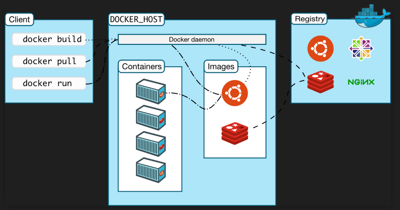

# Docker
## Docker 简介

### 什么是 Docker
官网地址：https://www.docker.com/

Docker 最初是 dotCloud 公司创始人 Solomon Hykes 在法国期间发起的一个公司内部项目，它是基于 dotCloud 公司多年云服务技术的一次革新，并于 [2013 年 3 月以 Apache 2.0 授权协议开源][docker-soft]，主要项目代码在 [GitHub](https://github.com/moby/moby) 上进行维护。Docker 项目后来还加入了 Linux 基金会，并成立推动 [开放容器联盟（OCI）](https://www.opencontainers.org/)。

Docker 使用 Google 公司推出的 [Go 语言](https://golang.org/) 进行开发实现，基于 Linux 内核的 [cgroup](https://zh.wikipedia.org/wiki/Cgroups)，[namespace](https://en.wikipedia.org/wiki/Linux_namespaces)，以及  [AUFS](https://en.wikipedia.org/wiki/Aufs) 类的 [Union FS](https://en.wikipedia.org/wiki/Union_mount) 等技术，对进程进行封装隔离，属于 [操作系统层面的虚拟化技术](https://en.wikipedia.org/wiki/Operating-system-level_virtualization)。由于隔离的进程独立于宿主和其它的隔离的进程，因此也称其为 **容器** 。最初实现是基于 [LXC](https://linuxcontainers.org/lxc/introduction/)，从 0.7 版本以后开始去除 LXC，转而使用自行开发的 [libcontainer](https://github.com/docker/libcontainer)，从 1.11 开始，则进一步演进为使用 [runC](https://github.com/opencontainers/runc) 和 [containerd](https://github.com/containerd/containerd)。

Docker 在容器的基础上，进行了进一步的封装，从文件系统、网络互联到进程隔离等等，极大的简化了容器的创建和维护。使得 Docker 技术比虚拟机技术更为轻便、快捷。

 Docker 与传统虚拟机技术较大不同，传统虚拟机技术是虚拟出一套硬件后，在其上运行一个完整操作系统，在该系统上再运行所需应用进程；而容器内的应用进程直接运行于宿主的内核，容器内没有自己的内核，而且也没有进行硬件虚拟。因此容器要比传统虚拟机更为轻便。

### 为什么需要 Docker

#### 概述

作为一种新兴的虚拟化方式，Docker 跟传统的虚拟化方式相比具有众多的优势。

#### 更高效的利用系统资源

由于容器不需要进行硬件虚拟以及运行完整操作系统等额外开销，Docker 对系统资源的利用率更高。无论是应用执行速度、内存损耗或者文件存储速度，都要比传统虚拟机技术更高效。因此，相比虚拟机技术，一个相同配置的主机，往往可以运行更多数量的应用。

#### 更快速的启动时间

传统的虚拟机技术启动应用服务往往需要数分钟，而 Docker 容器应用，由于直接运行于宿主内核，无需启动完整的操作系统，因此可以做到秒级、甚至毫秒级的启动时间。大大的节约了开发、测试、部署的时间。

#### 一致的运行环境

开发过程中一个常见的问题是环境一致性问题。由于开发环境、测试环境、生产环境不一致，导致有些 bug 并未在开发过程中被发现。而 Docker 的镜像提供了除内核外完整的运行时环境，确保了应用运行环境一致性，从而不会再出现 **「这段代码在我机器上没问题啊」** 这类问题。

#### 持续交付和部署

对开发和运维（[DevOps](https://zh.wikipedia.org/wiki/DevOps)）人员来说，最希望的就是一次创建或配置，可以在任意地方正常运行。

使用 Docker 可以通过定制应用镜像来实现持续集成、持续交付、部署。开发人员可以通过 `Dockerfile` 来进行镜像构建，并结合 [持续集成(Continuous Integration)](https://en.wikipedia.org/wiki/Continuous_integration) 系统进行集成测试，而运维人员则可以直接在生产环境中快速部署该镜像，甚至结合 [持续部署(Continuous Delivery/Deployment)](https://en.wikipedia.org/wiki/Continuous_delivery) 系统进行自动部署。

而且使用 `Dockerfile` 使镜像构建透明化，不仅仅开发团队可以理解应用运行环境，也方便运维团队理解应用运行所需条件，帮助更好的生产环境中部署该镜像。

#### 更轻松的迁移

由于 Docker 确保了执行环境的一致性，使得应用的迁移更加容易。Docker 可以在很多平台上运行，无论是物理机、虚拟机、公有云、私有云，甚至是笔记本，其运行结果是一致的。因此用户可以很轻易的将在一个平台上运行的应用，迁移到另一个平台上，而不用担心运行环境的变化导致应用无法正常运行的情况。

#### 更轻松的维护和扩展

Docker 使用的分层存储以及镜像的技术，使得应用重复部分的复用更为容易，也使得应用的维护更新更加简单，基于基础镜像进一步扩展镜像也变得非常简单。此外，Docker 团队同各个开源项目团队一起维护了一大批高质量的 [官方镜像](https://hub.docker.com/search/?q=&source=verified&type=image)，既可以直接在生产环境使用，又可以作为基础进一步定制，大大的降低了应用服务的镜像制作成本。

#### 对比传统虚拟机总结

|   特性     |   容器    |   虚拟机   |
| :--------   | :--------  | :---------- |
| 启动       | 秒级      | 分钟级     |
| 硬盘使用   | 一般为 `MB` | 一般为 `GB`  |
| 性能       | 接近原生  | 弱于       |
| 系统支持量 | 单机支持上千个容器 | 一般几十个 |


## 安装 Docker

### 平台支持

Docker CE 支持多种平台，如下表所示

#### 桌面

| 平台                                                         | 架构 |
| ------------------------------------------------------------ | ---- |
| [Docker Desktop for Mac \(macOS\)](https://docs.docker.com/docker-for-mac/install/) | X64  |
| [Docker Desktop for Windows \(Microsoft Windows 10\)](https://docs.docker.com/docker-for-windows/install/) | X64  |

#### 服务器

| 平台                                                         | x86\_64 / amd64 | ARM  | ARM64 / AARCH64 | IBM Power \(ppc64le\) | IBM Z \(s390x\) |
| ------------------------------------------------------------ | --------------- | ---- | --------------- | --------------------- | --------------- |
| [CentOS](https://docs.docker.com/install/linux/docker-ce/centos/) | ✔               |      | ✔               |                       |                 |
| [Debian](https://docs.docker.com/install/linux/docker-ce/debian/) | ✔               | ✔    | ✔               |                       |                 |
| [Fedora](https://docs.docker.com/install/linux/docker-ce/fedora/) | ✔               |      | ✔               |                       |                 |
| [Ubuntu](https://docs.docker.com/install/linux/docker-ce/ubuntu/) | ✔               | ✔    | ✔               | ✔                     | ✔               |

### 准备安装

#### 卸载旧版本

```bash
apt-get remove docker docker-engine docker.io containerd runc
```
#### 使用 APT 安装

```bash
apt install docker.io
```
#### 验证安装是否成功

```bash
docker version
# 输出如下
Client: Docker Engine - Community
 Version:           19.03.12
 API version:       1.40
 Go version:        go1.13.10
 Git commit:        48a66213fe
 Built:             Mon Jun 22 15:45:36 2020
 OS/Arch:           linux/amd64
 Experimental:      false

Server: Docker Engine - Community
 Engine:
  Version:          19.03.12
  API version:      1.40 (minimum version 1.12)
  Go version:       go1.13.10
  Git commit:       48a66213fe
  Built:            Mon Jun 22 15:44:07 2020
  OS/Arch:          linux/amd64
  Experimental:     false
 containerd:
  Version:          1.2.13
  GitCommit:        7ad184331fa3e55e52b890ea95e65ba581ae3429
 runc:
  Version:          1.0.0-rc10
  GitCommit:        dc9208a3303feef5b3839f4323d9beb36df0a9dd
 docker-init:
  Version:          0.18.0
  GitCommit:        fec3683
  ```
  
### 配置 Docker 镜像加速器
通过编辑 daemon 配置文件 `/etc/docker/daemon.json` 来使用加速器(因为使用的为腾讯云机器此处配置的为腾讯云的docker镜像加速，也可以配置阿里、163等镜像加速地址)

```bash
vi /etc/docker/daemon.json
{
  "registry-mirrors": ["https://mirror.ccs.tencentyun.com"]
}

# 执行以下命令，重启 Docker
systemctl daemon-reload
systemctl restart docker
# 检查加速器是否生效
docker info
#返回结果  Registry Mirrors:https://mirror.ccs.tencentyun.com/  包含你配置的加速地址则配置成功
```


## Docker 概述

### Docker 引擎

Docker 引擎是一个包含以下主要组件的客户端服务器应用程序。

- 一种服务器，它是一种称为守护进程并且长时间运行的程序。
- REST API 用于指定程序可以用来与守护进程通信的接口，并指示它做什么。
- 一个有命令行界面 (CLI) 工具的客户端。


### Docker 架构

- Docker 使用客户端 - 服务器 (C/S) 架构模式，使用远程 API 来管理和创建 Docker 容器。
- Docker 容器通过 Docker 镜像来创建。
- 容器与镜像的关系类似于面向对象编程中的对象与类。

| Docker | 面向对象 |
| :--- | :--- |
| 容器 | 对象 |
| 镜像 | 类 |



| 标题 | 说明 |
| :--- | :--- |
| 镜像(Images) | Docker 镜像是用于创建 Docker 容器的模板。 |
| 容器(Container) | 容器是独立运行的一个或一组应用。 |
| 客户端(Client) | Docker 客户端通过命令行或者其他工具使用 Docker API ([https://docs.docker.com/reference/api/docker\_remote\_api](https://docs.docker.com/reference/api/docker_remote_api)) 与 Docker 的守护进程通信。 |
| 主机(Host) | 一个物理或者虚拟的机器用于执行 Docker 守护进程和容器。 |
| 仓库(Registry) | Docker 仓库用来保存镜像，可以理解为代码控制中的代码仓库。Docker Hub([https://hub.docker.com](https://hub.docker.com/)) 提供了庞大的镜像集合供使用。 |
| Docker Machine | Docker Machine是一个简化Docker安装的命令行工具，通过一个简单的命令行即可在相应的平台上安装Docker，比如VirtualBox、 Digital Ocean、Microsoft Azure。 |