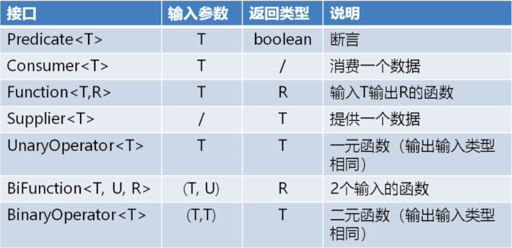

# Java8新特性

1. **Lambda** **表达式与函数式接口**
2. **引用**
3. **接口默认方法与静态方法**
4. **Stream API**
5. **Optional** **类减少空指针**
6. **新的时间日期函数**
7. **Nashorn**


## 函数式编程

### 函数式编程概念:

​        网络上没有一个清晰的概念说什么样的就是函数式编程，什么样的就是非函数识别，我个人的理解就是我们能熟练使用Stream API 和 Lambda 表达式，拥有函数编程思想并能应用到我们工作中，我们就可以说我们会函数式编程。

```java
/**
 * @Description Lambda 表达式与函数接口
 * @author evan_tang
 * @date 2019/1/31 9:46
 */
public class Lambda {
    public static void main(String[] args) {
       new Lambda().getMin();
        new Lambda().getMin2();
    }

    /**
     * 命令式编程 获取最小值
     */
    public void getMin() {
        // 初始化一个数组
        int[] nums = {1,2,3,4,5,6,7,8,9};
        // 定义最小值对象
        int minNum = Integer.MAX_VALUE;
        // 循环遍历数组与最小值比较
        for (int num : nums) {
            if (num < minNum) {
                minNum = num;
            }
        }
        // 遍历完输出最小值
        System.out.println(minNum);
    }

    /**
     * 函数式编程 获取最小值
     * 不关注怎么做怎么实现  利用现有的API 完成工作
     */
    public void getMin2() {
        // 初始化一个数组
        int[] nums = {1,2,3,4,5,6,7,8,9};
        // jdk8功能 创建流 利用流API实现
        int minNum = IntStream.of(nums).min().getAsInt();
        System.out.println(minNum);
    }
}
```


从上可以看出来都可以实现，我们的需求，使用函数式编程会简化我们的编码过程，当然这只是一个最简单的例子


##  Lambda表达式与函数式接口

###  Lambda表达式：

​      **Lambda表达式口决:拷贝小括号，写死右箭头，落地大括号**

- 拷贝小括号：找到接口中对应方法的声明，把小括号的部分整个拷贝过来，也就是(int x,int y)，如果只有个参数括号可以不要。

- 写死右箭头：在小括号后面必须接一个右箭头

- 落地大括号：写一个大括号，在括号之中写逻辑，如果只有一行可以省略大括号

  ```java
  // 语法形式
  (参数) -> 实现
  //或
  (参数) ->{ 实现; }
  ```

- 可选类型声明：可以不需要声明参数类型，编译器可以统一识别参数值。

- 可选的参数圆括号：只有一个参数可以不要小括号，但多个参数必须要小括号。

- 可选的大括号：如果业务逻辑只有一个语句，就不需要省略大括号。

- 可选的返回关键字：如果业务逻辑只有一个语句则编译器会自动返回值，多个则必须要使用return。

  ```java
  /**
       * Lambda 表达式 能够使用 Lambda 表达式都是函数式接口
       */
      public void lambda() {
          // Lambda 表达式返回的是一个 Runnable 接口
          Runnable hello_world = () -> System.out.println("Hello World");
          Runnable hello_world2 = () -> System.out.println("Hello World");
          new Thread(hello_world).start();
          new Thread(hello_world2).start();
          // 做个测试看看返回是不是同一对象
          System.out.println(hello_world == hello_world2);
          // 返回false  每个Lambda表达式 都是一个新的对象
      }
  ```
  
###  函数式接口:

**什么是函数式接口:在 Java 中是指有且仅有一个抽象方法的接口**

```java
// 格式
修饰符 interface 接口名称 {
    public abstract 返回值类型 方法名称(可选参数信息);
    // 其他非抽象方法内容 (默认、静态、私有)
}
// 例
public interface MyFunctionalInterface {
   // 1.8 中抽象方法可以省略 public abstract
    void myMethod();
}
// 在1.8中可以在接口上加上 @FunctionalInterface 伪代码用于检查提示是否为函数式接口 与 @Override 注解检测重写作用类似
```

####   Java 内置常用函数式接口




##   引用

###  方法引用:

> **方法引用**:是一种更简洁易懂的lambda表达式，操作符是双冒号:::，被用来直接访问类或者实例已经存在的方法或构造方法。方法引用提供了一种引用而不执行的方式，它需要由兼容的函数式接口构成的目标上下文。计算时，方法引用会创建函数式接口的一个实例。
>
> 方法引用形式有三种： 1、实例::实例方法名     2、 类名::静态方法名     3、类名::实例方法名

###  构造器引用:

> 构造器引用形式： 类名::new
>


###  数组引用:

> 数组引用形式：类型[]::new
>

