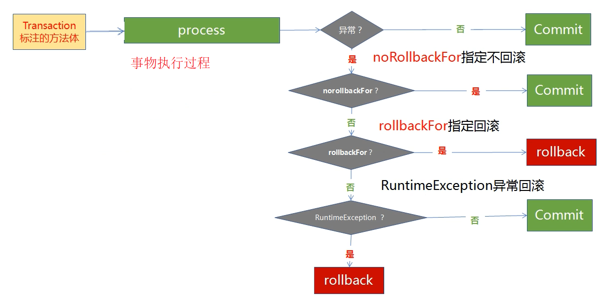

# 事物注意事项
此处为总结我了解的数据库事物使用注意事项,事物的实现都是基于JDK动态代理或cglib实现，本质都是通过AOP实现

## @Transactional 一般使用的位置
1.  使用在接口上(不建议如果AOP代理使用`cglib`将导致注解丢失事物不生效) 必须使用JDK代理才正常
2.  使用在类上 必须使用的方法为Public修饰的方法否则不生效,方法调用不能本地调用(即使用this调用)否则不生效

## 控制事物的回滚
Spring事物回滚判断流程图

1. spring默认对于`RuntimeException`进行回滚，对于`Exception`不回滚，若以要对`Exception`进行回滚，则要使用`rollbackFor`参数配置异常类实现指定异常类回滚
2. 如果对类使用@Transactional,如果中间有方法不使用事物则需要使用`Propagation`参数来指定事物传播机制`NOT_SUPPORTED`不使用事物
3. 如果特殊异常类不需要进行事物回滚,需要使用`noRollbackFor`异常类则该指定的异常则不进行回滚

## 数据库的事物的隔离级别
数据库的隔离级别由数据库实现不由Spring实现,数据库的4种隔离级别如下
1. Read uncommitted(读未提交)
可能存在脏读、不可重复读、幻读
2. Read committed(读已提交)    **Oracle默认隔离级别**
可能存在不可重复读、幻读
3. Repeatable read(可重复读)    **MySql默认隔离级别**
可能存在幻读
4. Serializable(串行化)

`脏读`：一个事务读取另一个事务未提交的修改数据
`不可重复读`：在同一个事物中多次进行同一个查询，由于其他事物进行数据修改或删除导致每次产生不同的结果
`幻读`：在同一个事物中多次进行同一个查询，由于其他事物进行数据插入导致每次产生不同的结果（在可重复读隔离级别下，普通查询是快照读，是不会看到别的事务插入的数据的，只有在当前读才会出现幻读，幻读专指新插入的行，读到原本存在行的更新结果不算。因为当前读的作用就是能读到所有已经提交记录的最新值）

## Spring事物7种传播机制
- PROPAGATION_REQUIRED—如果当前有事务，就用当前事务，如果当前没有事务，就新建一个事务。这是最常见的选择(默认传播机制)。
- PROPAGATION_SUPPORTS—支持当前事务，如果当前没有事务，就以非事务方式执行。
- PROPAGATION_MANDATORY—支持当前事务，如果当前没有事务，就抛出异常。 
- PROPAGATION_REQUIRES_NEW—新建事务，如果当前存在事务，把当前事务挂起。 
- PROPAGATION_NOT_SUPPORTED—以非事务方式执行操作，如果当前存在事务，就把当前事务挂起。
- PROPAGATION_NEVER—以非事务方式执行，如果当前存在事务，则抛出异常。
- PROPAGATION_NESTED—如果当前存在事务，则在嵌套事务内执行。如果当前没有事务，则进行与PROPAGATION_REQUIRED类似的操作。