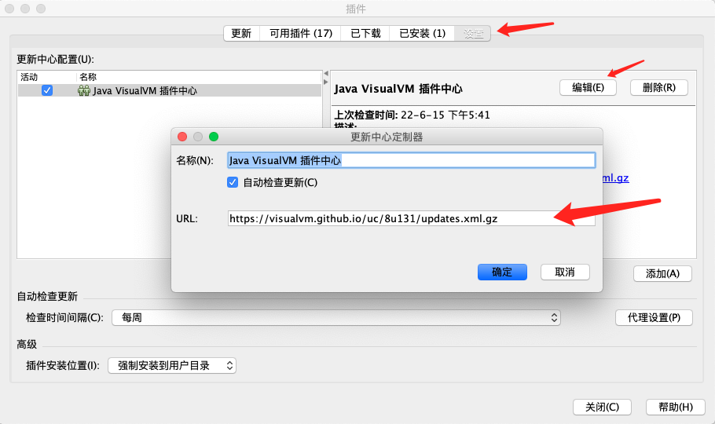
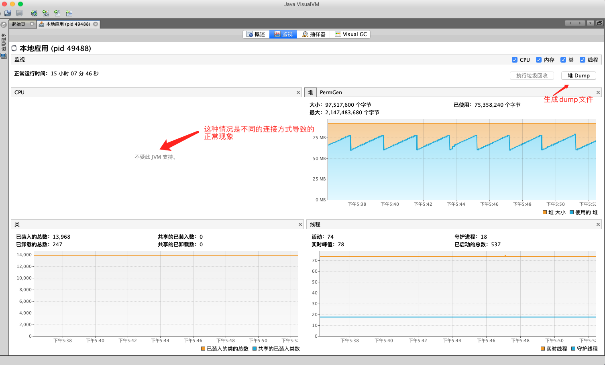
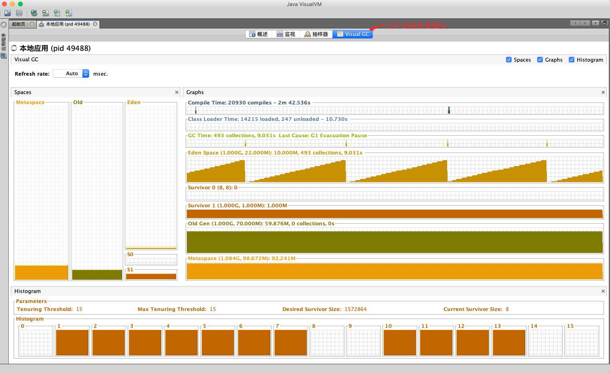

# JVisualVM使用

### 1. JVisualVM介绍

JVisualVM是一个Java虚拟机的监控工具，如果使用的JDK版本为1.8里已经自带了，可以用来简单监控。

启动页面如图，可以用于监控本地JVM和远程JVM


### 2. JVisualVM启动

打开JDK安装目录，找bin目录，进去就可以找到 jvisualvm，如果是用命令行开的，需要保持命令窗口开启，打开这个文件，就可以进入启动页。


### 3. JVisualVM安装插件

打开JVisualVM后，在上方菜单栏，找到工具 -> 插件 可以安装自己想要插件，如果不能安装插件或网络连接失败可以更改插件中心地址。


如果不能安装或者没有插件，需要使用搜索引擎，找使用使用版本的对应版本的插件中心地址，修改URL即可



### 4. JVisualVM监控页面解析

根据不同连接方法可以会有部分插件无法使用，可以同时使用多种连接方式。

JMX 连接不能使用GC监控插件

jstatd 连接不能监控CPU








### 5. SpringBoot jar包开启JMX远程连接

####  5.1 无密码方式开启JMX

​      注意：这种方式，知道地址后端口就可以直接连接，这些参数中间最好不要加其他参数，有时候会导致异常

```
# 部署的远程主机IP
-Djava.rmi.server.hostname=xxx.xxx.xx.xx 
# JMX方式使用端口 踩过的坑-记得开放端口访问权限
-Dcom.sun.management.jmxremote.port=8093 
# 踩过的坑-指定端口，可以和上面同一个，要不就随机产生，导致只开放一个端口访问不了
-Dcom.sun.management.jmxremote.rmi.port=8093 
# ssl方式关闭
-Dcom.sun.management.jmxremote.ssl=false 
# 不开启认证
-Dcom.sun.management.jmxremote.authenticate=false
```


#### 5.2 带用户和权限方式开启JMX

   这种就麻烦一点，需要在服务器创建两个文件，启动时并指定文件路径

```
# 部署的远程主机IP
-Djava.rmi.server.hostname=xxx.xxx.xx.xx 
# JMX方式使用端口 踩过的坑-记得开放端口访问权限
-Dcom.sun.management.jmxremote.port=8093 
# 踩过的坑-指定端口，可以和上面同一个，要不就随机产生，导致只开放一个端口访问不了
-Dcom.sun.management.jmxremote.rmi.port=8093
# ssl方式关闭
-Dcom.sun.management.jmxremote.ssl=false 
# 配置账号和权限  参数值为：jxmremote.access 文件在服务器上路径
-Dcom.sun.management.jmxremote.access.file=./jxmremote.access
# 配置账户和密码  参数值为：jxmremote.password 文件在服务器上路径
-Dcom.sun.management.jmxremote.password.file=./jxmremote.password
```

  配置账户和权限 （编辑jxmremote.access文件）

如：账号 admin  密码：123456 则如下，配置多个账号换行继续

```
admin 123456
```

  配置账户和密码 （编辑jxmremote.password文件）

如：账号 admin  读写权限：readwrite  则如下，配置多个账号换行继续  （readonly 表示只读）

```
admin readwrite
```


#### 5.3 JMX远程连接

 打开JVisualVM 找到远程，然后添加远程主机，然后输入远程主机IP和显示名称，默认显示名称就是IP


然后按自己实际情况填写，如果也开启了jstatd，则可以同时添加开启两种连接方式


