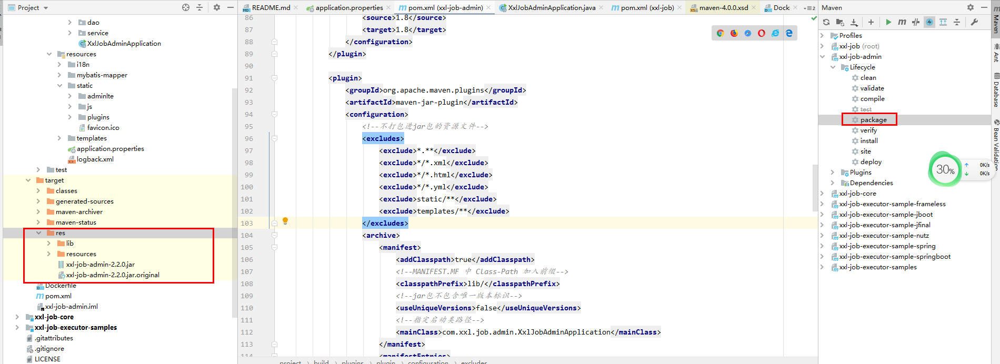

SpringBoot 打包很方便,开发后打个jar包很多依赖,每次修改代码部署,上传网速不好要等很久,比较浪费时间


在pom 中添加配置,添加后运行打包

```xml
<build>
		<plugins>
			<!--分离方式打包jar-->
			<plugin>
				<groupId>org.apache.maven.plugins</groupId>
				<artifactId>maven-compiler-plugin</artifactId>
				<version>3.5.1</version>
				<configuration>
					<source>1.8</source>
					<target>1.8</target>
				</configuration>
			</plugin>

			<plugin>
				<groupId>org.apache.maven.plugins</groupId>
				<artifactId>maven-jar-plugin</artifactId>
				<configuration>
					<!--排除进jar包的资源文件-->
					<excludes>
						<exclude>*.**</exclude>
						<exclude>*/*.xml</exclude>
						<exclude>*/*.html</exclude>
						<exclude>*/*.yml</exclude>
						<exclude>static/**</exclude>
						<exclude>templates/**</exclude>
					</excludes>
					<archive>
						<manifest>
							<addClasspath>true</addClasspath>
							<!--MANIFEST.MF 中 Class-Path 加入前缀-->
							<classpathPrefix>lib/</classpathPrefix>
							<!--jar包不包含唯一版本标识-->
							<useUniqueVersions>false</useUniqueVersions>
							<!--指定启动类路径-->
							<mainClass>com.xxl.job.admin.XxlJobAdminApplication</mainClass>
						</manifest>
						<manifestEntries>
							<!--MANIFEST.MF 中 Class-Path 加入资源文件目录-->
							<Class-Path>./resources/</Class-Path>
						</manifestEntries>
					</archive>
					<outputDirectory>${project.build.directory}/res</outputDirectory>
				</configuration>
			</plugin>
			<!--拷贝依赖 copy-dependencies 进res/lib目录下-->
			<plugin>
				<groupId>org.apache.maven.plugins</groupId>
				<artifactId>maven-dependency-plugin</artifactId>
				<executions>
					<execution>
						<id>copy-dependencies</id>
						<phase>package</phase>
						<goals>
							<goal>copy-dependencies</goal>
						</goals>
						<configuration>
							<outputDirectory>
								${project.build.directory}/res/lib/
							</outputDirectory>
						</configuration>
					</execution>
				</executions>
			</plugin>
			<!--拷贝资源文件 copy-resources 进res/resources目录下-->
			<plugin>
				<artifactId>maven-resources-plugin</artifactId>
				<executions>
					<execution>
						<id>copy-resources</id>
						<phase>package</phase>
						<goals>
							<goal>copy-resources</goal>
						</goals>
						<configuration>
							<resources>
								<resource>
									<directory>src/main/resources</directory>
								</resource>
							</resources>
							<outputDirectory>${project.build.directory}/res/resources</outputDirectory>
						</configuration>
					</execution>
				</executions>
			</plugin>
			<!--spring boot repackage，依赖 maven-jar-plugin 打包的jar包 重新打包成 spring boot 的jar包-->
			<plugin>
				<groupId>org.springframework.boot</groupId>
				<artifactId>spring-boot-maven-plugin</artifactId>
				<configuration>
					<!--重写包含依赖，包含不存在的依赖，jar里没有pom里的依赖-->
					<includes>
						<include>
							<groupId>null</groupId>
							<artifactId>null</artifactId>
						</include>
					</includes>
					<layout>ZIP</layout>
					<!--使用外部配置文件，jar包里没有资源文件-->
					<addResources>true</addResources>
					<outputDirectory>${project.build.directory}/res</outputDirectory>
				</configuration>
				<executions>
					<execution>
						<goals>
							<goal>repackage</goal>
						</goals>
						<configuration>
							<!--配置jar包特殊标识 配置后，保留原文件，生成新文件 *-run.jar -->
							<!--配置jar包特殊标识 不配置，原文件命名为 *.jar.original，生成新文件 *.jar -->
							<!--<classifier>run</classifier>-->
						</configuration>
					</execution>
				</executions>
			</plugin>
		</plugins>
	</build>
```


打包成功后出现  找到res 文件夹  将这个文件夹所有的上传到服务器后 以后修改后没有打包改动依赖和配置 就可以只上传jar包 不上传 lib 和resource文件



