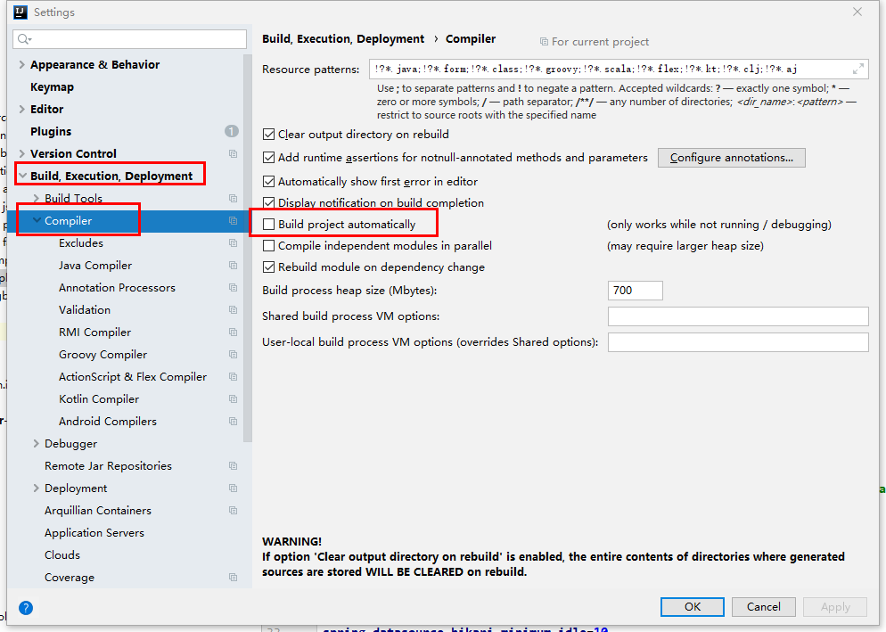
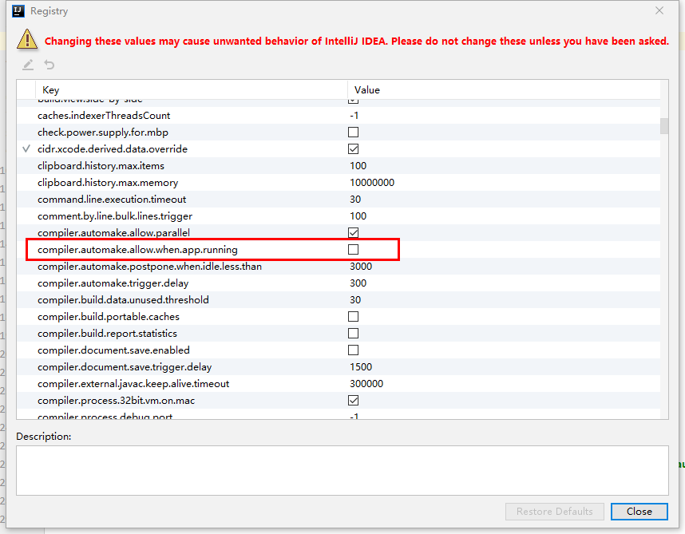

# SpringBoot项目热部署
最近接手一个别人的项目,问题较多,有时候修改的地方比较多,没修改一个地方就要重启验证一下,大大降低开发效率,以前也用过JRebel,但是它是一个收费的插件,然后又去了解了一下SpringBoot的热部署,这里我选择了一个比较简单的使用DevTools实现

### POM文件引入依赖
```xml
<!-- SpringBoot热部署依赖 -->
<dependency>
	<groupId>org.springframework.boot</groupId>
	<artifactId>spring-boot-devtools</artifactId>
        <!-- true才生效 -->
	<optional>true</optional>
</dependency>
``` 

### properties文件配置 
```properties
# 开启热部署
spring.devtools.restart.enabled: true
# 设置检测修改重启目录
spring.devtools.restart.additional-paths: src/main/java
# 设置检测修改不重启目录
spring.devtools.restart.exclude: WEB-INF/**
``` 

### IDEA中开启自动编译
在IDEA中依次 File->Settings->Compiler->Build Project automatically 打上勾 然后OK


### IDEA中开启运行时自动生成
在IDEA中依次 Help->Find Actions->选择上方Actions->搜索Registry-> 点进去,找到 compiler.automake.allow.when.app.running 勾上 然后Close



### 彻底关闭IDEA重启生效
