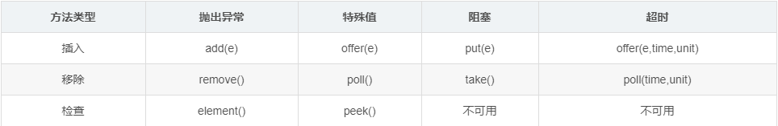
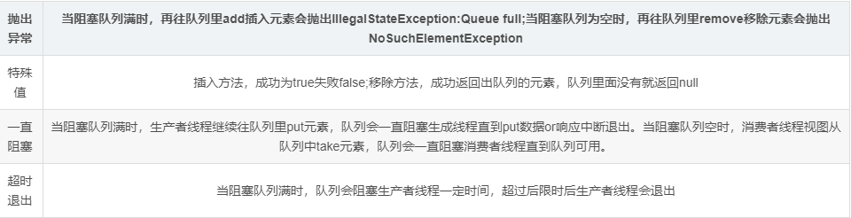
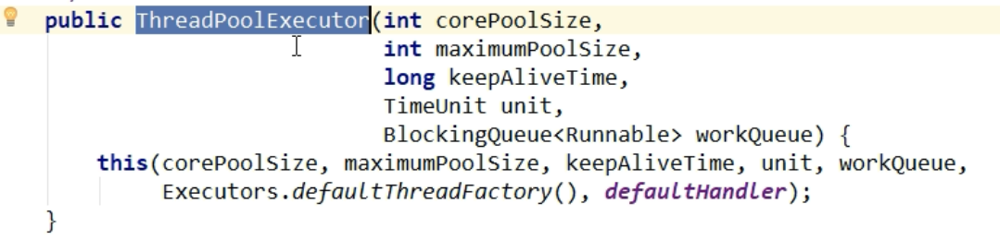
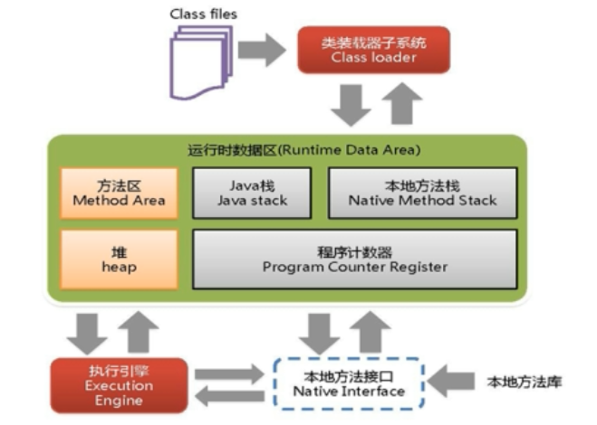

# Java常用总结

## 并发编程与多线程
java并发编程三大特性：`原子性`,`可见性`,`有序性`;
- 原子性:一个或者多个操作作为一个整体,执行过程中不可分割
- 可见性:多个线程访问同一个共享变量时,一个线程修改后,其他线程能够立刻知道
- 有序性:按照编写的代码顺序执行,不会进行优化排序

注意:多线程的条件判断使用while,不使用if
### volatile详解
volatile可以保证可见性和有序性,不能保证原子性,可以用于只有一个线程进行的修改操作的加锁,底层实现主要是通过内存屏障实现的,代码前面多出lock前缀(使用场景:1.共享状态的标识2:单例模式的双重检测锁)
内存屏障作用
1.重排序时不能把后面的指令重排序到内存屏障之前的位置
2.本CPU的Cache写入内存 
3.写入动作也会引起别的CPU或者别的内核Cache失效

### JMM(Java内存模型)
Java内存模型是一种抽象概念并不真实存在,JMM关于同步规定1.线程解锁前.必须讲共享变量的值刷新回主内存2.线程加锁前必须读取主内存的值到自己的工作内存3.加锁解锁是同一把锁

### ThreadLocal(本地线程)
ThreadLocal提供线程内部的局部变量，在本线程内随时随地可取，隔离其他线程,使用后记得清理防止线程池时数据混乱

### 单例模式实现
1、饿汉式(线程安全，调用效率高，但是不能延时加载)：
```java
public class ImageLoader{ 
     private static ImageLoader instance = new ImageLoader; 
     private ImageLoader(){} 
     public static ImageLoader getInstance(){  
          return instance;  
      } 
}
```
2、懒汉式(线程不安全，调用效率不高，但是能延时加载)：
```java
public class SingletonDemo2 {
     
    //类初始化时，不初始化这个对象(延时加载，真正用的时候再创建)
    private static SingletonDemo2 instance;
     
    //构造器私有化
    private SingletonDemo2(){}
     
    //方法同步，调用效率低
    public static synchronized SingletonDemo2 getInstance(){
        if(instance==null){
            instance=new SingletonDemo2();
        }
        return instance;
    }
}
```
2、Double CheckLock实现单例：
```java
// 指令重排序可能导致异常  加上 volatile
public class SingletonDemo5 {
        private volatile static SingletonDemo5 SingletonDemo5;
 
         private SingletonDemo5() {
        }
  
       public static SingletonDemo5 newInstance() {
             if (SingletonDemo5 == null) {
                synchronized (SingletonDemo5.class) {
                     if (SingletonDemo5 == null) {
                        // 分为三步 1.分配内存空间  2.初始化对象  3.将实列指向分配地址   2和3不存在依赖关系 多线程可能存在指令重新排序问题
                        SingletonDemo5 = new SingletonDemo5();
                    }
                }
             }
            return SingletonDemo5;
         }
     }
```
4、静态内部类实现模式（线程安全，调用效率高，可以延时加载）：
```java
public class SingletonDemo3 {
        private static class SingletonClassInstance {
            private static final SingletonDemo3 instance = new SingletonDemo3();
        }

        private SingletonDemo3() {
        }

        public static SingletonDemo3 getInstance() {
            return SingletonClassInstance.instance;
        }
    }
```
5、枚举类（线程安全，调用效率高，不能延时加载，可以天然的防止反射和反序列化调用）：
```java
public enum SingletonDemo4 {      
     //枚举元素本身就是单例
     INSTANCE;
     //添加自己需要的操作
     public void singletonOperation(){     
     }
}
```

### CAS(全称Compare And Swap比较并交换)
CAS有三个操作数，内存值V，旧的预期值E，要修改的新值N。当且仅当预期值E和内存值V相同时，将内存值V修改为N，否则什么都不做。
主要是基于Unsafe类所有方法都是native调用系统底层资源,(没公开源码)在jdk rt包sun\misc 下  主要是当前对象  当前对象内存地址  然后比较进行操作
JVM会帮我们实现汇编指令,基于硬件功能的系统原语

常用实现:JUC包下的原子类

缺点:1.线程多有些可能长期自旋带来CPU开销  2.只能保证一个变量原子操作  3.可能导致ABA问题

### ABA问题
CAS 比较并交换(只在意初始值和最后比较时候的值) 假设初始值为A 进入比较并交换 ,期间A被别的线程改成B并通知.然后又被别的线程改回A 此时初始线程获得A已经变更过 但是无法是识别出改动

解决办法:使用带时间戳(版本号)的原子引用 使用AtomicStampedReference类

### 原子引用
使用JUC包下AtomicReference类将对象实现原子操作

### 集合并发修改异常(java.util.ConcurrentModificationException)
#### ArrayList
ArrayList 初始不指定长度时为创建一个空的数组,当调用add方法时候的初始化为10
导致原因:
> add 方法没有加锁,并发写入时导致数据插入异常

解决办法: 
1. 使用Vectot类
> 方法都进行加锁
2. 使用Conllections类可以构造出线程安全的List   Conllections.synchronizedList(new ArrayList<>());
>
3. 使用JUC包下下CopyOnWriteArrayList
> 使用的为写时复制,读写分离思想,插入的时候将以前的数据复制一份扩容一个,填写完成后,将写完新增的的数据设置为原有数据

#### Set
Set 
导致原因:
> 

解决办法: 
2. 使用Conllections类可以构造出线程安全的Set
>
3. 使用JUC包下下CopyOnWriteArraySet
> 使用的为写时复制,读写分离思想,插入的时候将以前的数据复制一份扩容一个,填写完成后,将写完新增的的数据设置为原有数据

#### HashSet
HashSet 构建方法为创建一个HashMap 初始化一个大小长度为16 扩容系数为0.75的HashMap,HashSet调用add方法,设置的为value,不关注key key 使用的为一个PRESENT的object对象常量

导致原因:
> 

解决办法: 

#### Map
Map 
导致原因:
> 

解决办法: 
1. 使用Conllections类可以构造出线程安全的Map 
>
2. 使用JUC包下下ConcurrentHashMap
> 使用的为写时复制,读写分离思想,插入的时候将以前的数据复制一份扩容一个,填写完成后,将写完新增的的数据设置为原有数据

### Java的锁
Java有15种锁
Synchronized 使用范围
1. 修饰一个代码块，被修饰的代码块称为同步语句块，其作用的范围是大括号{}括起来的代码，作用的对象是调用这个代码块的对象；
2. 修饰一个方法，被修饰的方法称为同步方法，其作用的范围是整个方法，作用的对象是调用这个方法的对象； 
3. 修改一个静态的方法，其作用的范围是整个静态方法，作用的对象是这个类的所有对象； 
4. 修改一个类，其作用的范围是synchronized后面括号括起来的部分，作用主的对象是这个类的所有对象。

ReentrantLock 使用 一定要记得解锁,可以加多重锁不过要加锁和解锁一一对应,不对应不会报错但是运行会退不出来
```
// 创建对象
private Lock lock = new ReentrantLock();
// 加锁  
lock.lock();
// 解锁 
lock.unlock();
```

#### Synchronized和ReentrantLock的区别
1. Synchronized 是Java关键字,ReentrantLock 是JUC并发包下的类
2. Synchronized 不需要手动释放锁,ReentrantLock 需要手动加锁解锁
3. Synchronized 不可中断,除非抛出异常或正常完成, ReentrantLock 可中断 1. 设置超时方法 tryLock  2. lockInterruptibly 可中断的获取锁
4. Synchronized 是非公平的锁,ReentrantLock 默认是非公平的,可设置
5. ReentrantLock 可以绑定多个条件Condition 实现线程条件唤醒


#### 什么是公平锁和非公平锁
>公平锁不允许加塞,多个线程按照申请锁的顺序来,非公平锁即允许后面的线程先尝试申请获取锁,获取不到才进行公平. 非公平锁优点吞吐量比公平锁大
>ReentrantLock 默认不传构造为false 为非公平锁,Synchronized 也是非公平锁
#### 可重入锁(递归锁)
>同一个线程,在外层函数获取到锁之后,内层递归函数任然可以获取到锁
>ReentrantLock和Synchronized都是可重入锁,好处是可以防止死锁
#### 死锁
> 多个线程,相互持有对方的锁,导致的线程等待
#### 自旋锁
> 线程获取锁不会阻塞,而是采用死循环的方式尝试获取锁,好处可以减少线程上下文切换的消耗,缺点循环会消耗CPU

手写一个自旋锁
```java
public class MyLock{
    //原子引用线程
    AtomicReference<Thread> atomicReference = new AtomicReference<>();
    // 自旋加锁
    public void myLock() {
        Thread thread = Thread.currentThread();
        while (!atomicReference.compareAndSet(null, thread)) {

        }
    }
    // 解锁不用自旋
    public void myUnLock() {
        Thread thread = Thread.currentThread();
        atomicReference.compareAndSet(thread, null);
    }

    public static void main(String[] args) {
        MyLock myLock = new MyLock();

        new Thread(() -> {
            myLock.myLock();
            try {
                TimeUnit.SECONDS.sleep(5);
            } catch (InterruptedException e) {
                e.printStackTrace();
            }
            myLock.myUnLock();

        }, "t1").start();

        try {
            TimeUnit.SECONDS.sleep(2);
        } catch (InterruptedException e) {
            e.printStackTrace();
        }

        new Thread(() -> {
            myLock.myLock();
            myLock.myUnLock();
        }, "t2").start();

    }
}
```

#### 独占锁(写锁)、共享锁(读锁)、互斥锁
> 读-读锁可以共存,读-写不能共存,写-写不能共存
使用 
```
// 获取锁
ReentrantReadWriteLock lock = new ReentrantReadWriteLock();
// 定义锁类型 加锁 写锁
lock.writeLock().lock();
// 锁类型 解锁 写锁
lock.writeLock().unlock();
// 定义锁类型 加锁 读锁
lock.readLock().lock();
// 锁类型 解锁  读锁
lock.readLock().unlock();
```

### CountDownLatch、、

#### CountDownLatch（线程计数器）
只有一个构造方法,必须传入数字,重要方法  await() 调用次方法将被等待 直到线程为0才继续  countDown() 将计数器数量减一  await(long timeout, TimeUnit unit) 设定带时间的等待超过时间将唤醒
使用
使用场景:等待所有线程干完后执行(通常为一个线程等待多个)
```
// 初始化计数器 计数器10个
CountDownLatch cdl = new CountDownLatch(10);
// 计数器减一
cdl.countDown();
// 阻塞 等计数器归零 
cdl.await();
```

#### CyclicBarrier（循环栅栏）
初始化指定 参与的线程数,初始化指定 参与的线程数和要做的任务两种构造方法,常用方法  await() 表示到达栅栏等待 await(long timeout, TimeUnit unit) 带时间的等待,getNumberWaiting()等待的线程数,getParties()启动还需要参与数,isBroken()检查屏障状态,reset()重置屏障状态
使用场景:等待参与者都到后干莫件事情(多个都进行等待,人到齐后先执行够钟方法中的任务 再所有的方法同时执行)
```
// 初始化计数器 计数器10个 最后干的事情
CyclicBarrier barrier = new CyclicBarrier(10, new Runnable() {
            
            @Override
            public void run() {
                System.out.println(Thread.currentThread().getName() + " 完成最后任务");
            }
        });
// 到达 
barrier.await();
```
#### Semaphore（信号量）
初始化指定信号量,是否公平,主要方法 acquire() 占用资源,调用后没获得前一直将线程阻塞，否则线程被中断 release()释放资源 占用资源后必须释放资源,availablePermits()当前剩余许可数,asQueuedThreads()查询是否有线程等待
使用场景:多个资源互斥使用,控制并发数,有一种特殊场景先调用release，会增加一个资源，再次acquire便可以获取新增的资源,使用需要注意
```
// 初始化指定信号量
Semaphore semaphore = new Semaphore(10);
// 占用资源
 semaphore.acquire();
// 释放资源
 semaphore.release();
```

### 阻塞队列
当阻塞队列为空时,从队列中获取数据的操作将被阻塞
当阻塞队列为满时,从队列中插入数据的操作将被阻塞

Collection -> Queue -> BlockingQueue -> 7个实现类
### 阻塞队列实现
1. **ArrayBlockingQueue** : 由数组组成的有界阻塞队列
2. **LinkBlockingQueue** : 由链表组成的有界阻塞队列(默认值为Int最大值,几乎无界)
3. PriorityBlockingQueue : 支持优先级排序的无界阻塞队列
4. DelayBlockingQueue : 使用优先级队列实现的延迟无界阻塞队列
5. **SynchronousBlockingQueue** :不存储元素的阻塞队列,即单个元素的队列
6. LinkedTransferBlockingQueue : 由链表结构组成的无界阻塞队列
7. LinkBlockingDeque : 由链表结构组成的双向阻塞队列

#### BlockingQueue 核心方法



### 获得线程的方法
1. 继承Thread类
2. 实现Runnable接口(无返回值的不拋出异常) 
3. 使用线程池
3. 实现Callable接口(使用FutureTask类构造实现，有返回值抛出异常)
- FutureTask 常用知识
>- 使用isDone 可以获取Future模式是否计算完成
>- 使用get可以获取返回值(获取值时为阻塞的,一般放最后) 
>- 多个线程使用Future只有一个进入


### 线程池
#### 为什么使用线程池
1. 线程池可以控制线程工作数,方便管理
2. 减少线程创建和销毁,降低消耗

##### 线程池 ThreadPoolExecutor 七大参数详解
底层最后是this调用  方法重载，展现出来的为5个参数实际为7个参数

1. corePoolSize(核心线程数):线程池中会维护一个最小的线程数量，即使这些线程处理空闲状态，他们也不会被销毁，除非设置了allowCoreThreadTimeOut
2. maximumPoolSize (线程池最大线程数):线程池最大能够创建的线程数量
3. keepAliveTime (空闲线程存活时间):一个线程如果处于空闲状态，并且当前的线程数量大于corePoolSize，那么在指定时间后，这个空闲线程会被销毁，这里的指定时间由keepAliveTime来设定
4. unit (空闲线程存活时间单位):keepAliveTime 的单位
5. workQueue (工作队列):新任务被提交后，会先进入到此工作队列中，任务调度时再从队列中取出任务。JDK中提供了四种工作队列
6. threadFactory (线程工厂):创建一个新线程时使用的工厂，可以用来设定线程名、是否为daemon线程等等一般使用默认就可以
7. handler (拒绝策略):当工作队列中的任务已到达最大限制，并且线程池中的线程数量也达到最大限制，这时如果有新任务提交进来的处理策略JDK中提供了四种拒绝策略

#### 线程池提交任务流程
1. 提交任务后判断核心线程池是否已满，没满则创建一个新的工作线程来执行任务。已超过核心线程数则进入下一步
2. 判断队列是否已满,没满则将新提交的任务添加在工作队列，已满则进行下一步
3. 判断线程池中当前线程数是否大于最大线程数，如果小于，则创建一个新的线程来执行这个任务，如果大于，则执行饱和策略
4. 当一个线程完成任务,将会从队列中获取下个任务来执行
5. 当一个线程无事情可做,且当前线程数大于核心线程数将会销毁线程

#### 线程池为什么需要使用（阻塞）队列?
1. 因为线程若是无限制的创建，可能会导致内存占用过多而产生OOM，同时过多线程会造成cpu过度切换降低效率。
2. 线程的创建线程和销毁线程消耗比较高,使用队列可以减少创建和销毁线程

#### 线程池为什么要使用阻塞队列而不使用非阻塞队列？
1. 阻塞队列可以保证任务队列中没有任务时阻塞获取任务的线程，使得线程进入wait状态，释放cpu资源。

#### Java8线程池(6种)
1. `newSingleThreadExecutor` : 创建一个单线程的线程池，适用于需要保证顺序执行各个任务。
2. `newFixedThreadPool` : 创建一个固定大小的线程池，因为采用有界的阻塞队列(默认值为Int最大值)，所以实际线程数量几乎不会变化，适用于负载较重的场景，对当前线程数量进行限制。（保证线程数可控，不会造成线程过多，导致系统负载更为严重）
3. `newCachedThreadPool` : 创建一个可缓存线程池，如果线程池长度超过处理需要，可灵活回收空闲线程，若无可回收，则新建线程。。
4. `newScheduledThreadPool` : 创建一个定长线程池，支持定时及周期性任务执行。
5. `newSingleThreadScheduledExecutor ` : 创建只有一条线程的线程池，他可以在指定延迟后执行线程任务 
6. `newWorkStealingPool` : 会更加所需的并行层次来动态创建和关闭线程,不是ThreadPoolExecutor的扩展是,ForkJoinPool的扩展(JDK1.8新出的线程池)。

#### 生产上使用线程池
生产上使用都是使用自定线程池
```
//获取当前机器的核数
public static final int cpuNum = Runtime.getRuntime().availableProcessors();
// 创建自定义线程池
private static ThreadPoolExecutor threadPoolExecutor = new ThreadPoolExecutor(cpuNum,cpuNum * 2,1,TimeUnit.MINUTES,new LinkedBlockingQueue<>(100),new NamedThreadFactory("模块名-Thread-"),new ThreadPoolExecutor.DiscardPolicy());
```
使用JDK的线程池容易导致OOM(Out Of Memory)
最后的拒绝策略有
1. ThreadPoolExecutor.`AbortPolicy`:丢弃任务并抛出RejectedExecutionException异常。（默认handle）
2. ThreadPoolExecutor.`DiscardPolicy`：直接丢弃任务，但是不抛出异常。(允许丢弃最好的选择)
3. ThreadPoolExecutor.`DiscardOldestPolicy`：抛弃队列中等待最久的,把当前任务加入此队列中,尝试提交当前任务（重复此过程）
4. ThreadPoolExecutor.`CallerRunsPolicy`：将任务回退给调用者,由调用线程处理该任务。

##### 线程池合理配置
1. CPU密集型:配置为CPU数量加1或者CPU数量
2. IO密集型: CPU/(1 - 阻塞系数)   阻塞系数一般为 0.8-0.9  简单设置为 2*CPU

最后我的选择,试了比较久 核心线程数配置的为CPU数 最大线程数配置的2*CPU数


## AQS(AbstractQueuedSynchronizer)


## 计算机网络面试知识

## 数据库
### MySQL重点
### explain(模拟优化器执行SQL)
explain 模拟优化器执行SQL,从而知道MySQL如何处理我们的SQL,知道瓶颈在哪里从而优化SQL

explain 能够查看的信息: 1. 表的读取顺序 2. 数据读取操作的类型 3. 那些索引可以被使用 4. 索引被实际使用  5. 表之间的关系 6. 每张表的查询行数
- `id`: 表示查询顺序,值越大越先执行,值一样靠上面的先执行
- `select_type`: 表示查询类型,有 SIMPLE,PRIMARY,UNION,DEPENDENT UNION,UNIOIN RESULT,SUBQUERY,DEPENDENT SUBQUERY,DERIVED,MATERIALIZED,UNCACHEABLE SUBQUERY,UNCACHEABLE UNION
>- SIMPLE: 简单查询查询中不包含子查询或者UNION
>- PRIMARY: 
>- SUBQUERY:
>- DERIVED:在FROM列表中包含的子查询会被标记为DERIVED(衍生)会递归执行这些子查询,把结果放在临时表中
>- UNION:
>- UNIOIN RESULT:
- `table`: 本次操作的表
- `type`: 使用索引的类型 执行好坏顺序 system > const > eq_ref > ref > range > index > ALL  7种
> - system: 表只有一行数据,相当于系统表
> - const: 在索引树上获取结果
> - eq_ref: 唯一索引扫描,表中只有一条数据匹配.常见于主键和唯一键
> - ref: 非唯一索引,返回匹配某个单独值的所有的行
> - range: 有范围的索引扫描
> 
> 一般使用大于range就可以
> - index:Full Index Scan 遍历索引树,通常比ALL快,ALL从硬盘中读取,Index从索引中读取
> - ALL: 全表扫描
- `possible_key`:可能使用到的索引
- `key`: 实际使用到的索引,如果为 null 则表示没有使用索引
- `key_len`: 索引字段最大可能长度
- `ref`: 两表联合时使用的索引,索引的哪一列被使用了
- `rows`: 表有多少行被优化器 查询
- `Extra`: 包含不适合展示在其他列但是十分重要的信息
> 1. Using filesort 不是按照表中索引顺序读取,使用外部索引排序称为文件排序
> 2. Using temporary 使用临时表
> 3. Using index 表示select中使用了覆盖索引,避免访问使用表中的数据行,如果没有出现Using where 表示索引用了读取数据而非查找数据(一般是使用索引排序后不符合要求,后面进行在此排序)
> 4. Using where 使用where进行过滤
> 5. Using join buffer 使用了连接缓存
> 6. impossible where where字句的值总是false 不能用于获取任何元组
> 7. select tables optimized away 
> 8. distinct distinct进行了优化操作


## Redis

## Linux

## JVM


Java虚拟机栈:每个方法被调用时都会创建一个栈帧
堆:虚拟机中内存最大的一块.所有线程共享,GC主要管理区域
方法区:存储被虚拟机加载的类的信息,常量.静态变量,编译后的代码等数据,运行时常量池也在这里
直接内存:并不是虚拟机运行时数据区的一部分,也不是Java虚拟机规范定义的内存区域

### GC
#### 垃圾回收算法
- 标记清除:分为标记阶段和清除阶段。标记阶段的任务是标记出所有需要被回收的对象，清除阶段就是回收被标记的对象所占用的空间。
> 缺点:容易产生内存碎片，碎片太多可能会导致后续过程中需要为大对象分配空间时无法找到足够的空间而提前触发新的一次垃圾收集动作。
- 复制算法:它将可用内存按容量划分为大小相等的两块，每次只使用其中的一块。当这一块的内存用完了，就将还存活着的对象复制到另外一块上面，然后再把已使用的内存空间一次清理掉，这样一来就不容易出现内存碎片的问题。
>缺点:减少了内存利用率,只使用一半空间
- 标记整理:先进行标记,标志可以回收的对象,然后将存活的对象移动到其它一端,然后清除端边际以外的内存

- 分代收集:分代收集算法是目前大部分JVM的垃圾收集器采用的算法,一般情况下将堆区划分为老年代（Tenured Generation）和新生代（Young Generation），老年代的特点是每次垃圾收集时只有少量对象需要被回收，而新生代的特点是每次垃圾回收时都有大量的对象需要被回收,新生代一般都采取复制算法，老年代采用标记整理算法

#### 垃圾回收器
- Serial/Serial Old : 最基本最古老的收集器，它是一个单线程收集器，并且在它进行垃圾收集时，必须暂停所有用户线程
>Serial收集器是针对新生代的收集器，采用的是Copying算法，Serial Old收集器是针对老年代的收集器，采用的是Mark-Compact算法。它的优点是实现简单高效，但是缺点是会给用户带来停顿。
- ParNew : Serial收集器的多线程版本，使用多个线程进行垃圾收集

- Parallel Scavenge : 是一个新生代的多线程收集器（并行收集器），它在回收期间不需要暂停其他用户线程
>它主要是为了达到一个可控的吞吐量。
- Parallel Old : Parallel Scavenge收集器的老年代版本（并行收集器），使用多线程和Mark-Compact算法

- CMS : 一种以获取最短回收停顿时间为目标的收集器，它是一种并发收集器，采用的是Mark-Sweep算法

- G1 : 它是一款并行与并发收集器，并且它能建立可预测的停顿时间模型。

### 类加载机制
#### 类加载过程
`加载` -> `验证` -> `准备` -> `解析` -> `初始化`

**加载**
>类加载过程的一个阶段，ClassLoader通过一个类的完全限定名查找此类字节码文件，并利用字节码文件创建一个class对象。

**验证**
>目的在于确保class文件的字节流中包含信息符合当前虚拟机要求，不会危害虚拟机自身的安全，主要包括四种验证：文件格式的验证，元数据的验证，字节码验证，符号引用验证。

**准备**
>为类变量（static修饰的字段变量）分配内存并且设置该类变量的初始值，（如static int i = 5 这里只是将 i 赋值为0，在初始化的阶段再把 i 赋值为5)，这里不包含final修饰的static ，因为final在编译的时候就已经分配了。这里不会为实例变量分配初始化，类变量会分配在方法区中，实例变量会随着对象分配到Java堆中。

**解析**
>把常量池中的符号引用替换成直接引用

**初始化**
>是类记载的最后阶段，如果该类具有父类就进行对父类进行初始化，执行其静态初始化器（静态代码块）和静态初始化成员变量。（前面已经对static 初始化了默认值，这里我们对它进行赋值，成员变量也将被初始化）


#### 类加载器
JDK提供了 启动类加载器 扩展类加载器  应用程序加载器 我们自己还可以自定义类加载器

- 启动类加载器:它负责加载存放在JDK\jre\lib,或被-Xbootclasspath参数指定的路径中的，并且能被虚拟机识别的类库,启动类加载器是无法被Java程序直接引用的
- 扩展类加载器:它负责加载JDK\jre\lib\ext目录中，或者由java.ext.dirs系统变量指定的路径中的所有类库，开发者可以直接使用扩展类加载器。
- 应用程序加载器:它负责加载用户类路径（ClassPath）所指定的类，开发者可以直接使用该类加载器，如果应用程序中没有自定义过自己的类加载器，一般情况下这个就是程序中默认的类加载器。

**双亲委派模型**:
如果一个类加载器收到了类加载请求，它并不会自己先去加载，而是把这个请求委托给父类的加载器去执行，如果父类加载器还存在其父类加载器，则进一步向上委托，依次递归，请求最终将到达顶层的启动类加载器，如果父类加载器可以完成类加载任务，就成功返回，倘若父类加载器无法完成此加载任务，子加载器才会尝试自己去加载，这就是双亲委派模式

**双亲委派模式优势**:
一个可以避免类的重复加载(Java中判断是否为同一个类通过判断类和类加载器两个判断),类和类加载器使之具有优先级,防止java的核心API被篡改


Java中基本类型都是传递的副本    栈管运行  堆管存储

### 死锁问题排查
1. jsp 查找当前运行的java程序进程号
2. 使用 jstack 进程号打出堆栈信息


## 常用类库

## Spring
### Spring的IOC容器的初始化
是一个很大的HashMap,将项目中的Bean,一般使用类名称首字母小写作为key,对象作为value

## SpringBoot
### SpringBoot启动机制
注解@SpringBootApplication 包含了@SpringBootConfiguration,@EnableAutoConfiguration,@ComponentScan

## Nginx

## 基础知识
### HashMap详解
HashMap是线程不安全的,底层基于数组+链表,在JDK1.8以后使用的为数组+链表+红黑树,当链表长度超过8时将转为红黑树,数组初始长度为16,扩容触发条件为0.75,扩容后变成原来的2倍
快速存储,快速查找,可扩容
线程安全的可以使用HashTable和ConcurrentHashMap,HashTable保障线程安全为所有的方法都加了Synchronized关键字,ConcurrentHashMap保证线程安全为进行分段锁
### ConcurrentHashMap详解
ConcurrentHashMap是线程安全的,保障线程安全为使用分段锁

JDK1.7以前实现分段锁:ConcurrentHashMap中维护着一个Segment数组，每个Segment可以看做是一个HashMap,而Segment本身继承了ReentrantLock，它本身就是一个锁,Segment中通过HashEntry数组来维护其内部的hash表，通过next字段引用到其下一个元素


JDK1.8实现分段锁:锁的粒度更加细致.使用了Synchronized


### Java常用数据结构有那些?
1. 线性表（ArrayList）
2. 链表（LinkedList）
3. 栈（Stack）
4. 队列（Queue）
5. 图（Map）
6. 树（Tree）

### 常用排序算法


## 工作经验解决问题流程
1. 故障现象
2. 导致原因
3. 解决方案
4. 优化建议