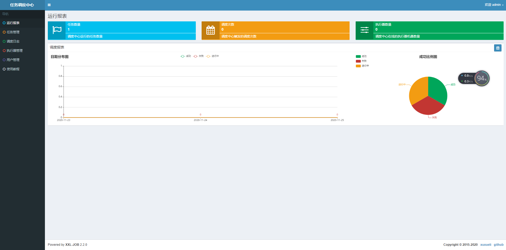

# XXL-JOB定时任务框架
## 一、简介

### 1.1 概述

>  XXL-JOB是一个分布式任务调度平台，其核心设计目标是开发迅速、学习简单、轻量级、易扩展。现已开放源代码并接入多家公司线上产品线，开箱即用。 

### 1.2 特性

> - 1、简单：支持通过Web页面对任务进行CRUD操作，操作简单，一分钟上手；
> - 2、动态：支持动态修改任务状态、启动/停止任务，以及终止运行中任务，即时生效；
> - 3、调度中心HA（中心式）：调度采用中心式设计，“调度中心”自研调度组件并支持集群部署，可保证调度中心HA；
> - 4、执行器HA（分布式）：任务分布式执行，任务”执行器”支持集群部署，可保证任务执行HA；
> - 5、注册中心: 执行器会周期性自动注册任务, 调度中心将会自动发现注册的任务并触发执行。同时，也支持手动录入执行器地址；
> - 6、弹性扩容缩容：一旦有新执行器机器上线或者下线，下次调度时将会重新分配任务；
> - 7、触发策略：提供丰富的任务触发策略，包括：Cron触发、固定间隔触发、固定延时触发、API（事件）触发、人工触发、父子任务触发；
> - 8、调度过期策略：调度中心错过调度时间的补偿处理策略，包括：忽略、立即补偿触发一次等；
> - 9、阻塞处理策略：调度过于密集执行器来不及处理时的处理策略，策略包括：单机串行（默认）、丢弃后续调度、覆盖之前调度；
> - 10、任务超时控制：支持自定义任务超时时间，任务运行超时将会主动中断任务；
> - 11、任务失败重试：支持自定义任务失败重试次数，当任务失败时将会按照预设的失败重试次数主动进行重试；其中分片任务支持分片粒度的失败重试；
> - 12、任务失败告警；默认提供邮件方式失败告警，同时预留扩展接口，可方便的扩展短信、钉钉等告警方式；
> - 13、路由策略：执行器集群部署时提供丰富的路由策略，包括：第一个、最后一个、轮询、随机、一致性HASH、最不经常使用、最近最久未使用、故障转移、忙碌转移等；
> - 14、分片广播任务：执行器集群部署时，任务路由策略选择”分片广播”情况下，一次任务调度将会广播触发集群中所有执行器执行一次任务，可根据分片参数开发分片任务；
> - 15、动态分片：分片广播任务以执行器为维度进行分片，支持动态扩容执行器集群从而动态增加分片数量，协同进行业务处理；在进行大数据量业务操作时可显著提升任务处理能力和速度。
> - 16、故障转移：任务路由策略选择”故障转移”情况下，如果执行器集群中某一台机器故障，将会自动Failover切换到一台正常的执行器发送调度请求。
> - 17、任务进度监控：支持实时监控任务进度；
> - 18、Rolling实时日志：支持在线查看调度结果，并且支持以Rolling方式实时查看执行器输出的完整的执行日志；
> - 19、GLUE：提供Web IDE，支持在线开发任务逻辑代码，动态发布，实时编译生效，省略部署上线的过程。支持30个版本的历史版本回溯。
> - 20、脚本任务：支持以GLUE模式开发和运行脚本任务，包括Shell、Python、NodeJS、PHP、PowerShell等类型脚本;
> - 21、命令行任务：原生提供通用命令行任务Handler（Bean任务，”CommandJobHandler”）；业务方只需要提供命令行即可；
> - 22、任务依赖：支持配置子任务依赖，当父任务执行结束且执行成功后将会主动触发一次子任务的执行, 多个子任务用逗号分隔；
> - 23、一致性：“调度中心”通过DB锁保证集群分布式调度的一致性, 一次任务调度只会触发一次执行；
> - 24、自定义任务参数：支持在线配置调度任务入参，即时生效；
> - 25、调度线程池：调度系统多线程触发调度运行，确保调度精确执行，不被堵塞；
> - 26、数据加密：调度中心和执行器之间的通讯进行数据加密，提升调度信息安全性；
> - 27、邮件报警：任务失败时支持邮件报警，支持配置多邮件地址群发报警邮件；
> - 28、推送maven中央仓库: 将会把最新稳定版推送到maven中央仓库, 方便用户接入和使用;
> - 29、运行报表：支持实时查看运行数据，如任务数量、调度次数、执行器数量等；以及调度报表，如调度日期分布图，调度成功分布图等；
> - 30、全异步：任务调度流程全异步化设计实现，如异步调度、异步运行、异步回调等，有效对密集调度进行流量削峰，理论上支持任意时长任务的运行；
> - 31、跨语言：调度中心与执行器提供语言无关的 RESTful API 服务，第三方任意语言可据此对接调度中心或者实现执行器。除此之外，还提供了 “多任务模式”和“httpJobHandler”等其他跨语言方案；
> - 32、国际化：调度中心支持国际化设置，提供中文、英文两种可选语言，默认为中文；
> - 33、容器化：提供官方docker镜像，并实时更新推送dockerhub，进一步实现产品开箱即用；
> - 34、线程池隔离：调度线程池进行隔离拆分，慢任务自动降级进入”Slow”线程池，避免耗尽调度线程，提高系统稳定性；
> - 35、用户管理：支持在线管理系统用户，存在管理员、普通用户两种角色；
> - 36、权限控制：执行器维度进行权限控制，管理员拥有全量权限，普通用户需要分配执行器权限后才允许相关操作；


### 1.3 下载

#### 文档地址

- [中文文档](https://www.xuxueli.com/xxl-job/)

- [English Documentation](https://www.xuxueli.com/xxl-job/en/)

#### 源码仓库地址

| 源码仓库地址                         | Release Download                                          |
| :----------------------------------- | :-------------------------------------------------------- |
| https://github.com/xuxueli/xxl-job   | [Download](https://github.com/xuxueli/xxl-job/releases)   |
| http://gitee.com/xuxueli0323/xxl-job | [Download](http://gitee.com/xuxueli0323/xxl-job/releases) |

#### 中央仓库地址

```mave
<!-- http://repo1.maven.org/maven2/com/xuxueli/xxl-job-core/ -->
<dependency>
    <groupId>com.xuxueli</groupId>
    <artifactId>xxl-job-core</artifactId>
    <version>${最新稳定版本}</version>
</dependency>
```

### 1.4 要求环境

> - Maven3+
> - Jdk1.8+
> - Mysql5.7+


## 二、快速入门

### 2.1 源码目录结构

>  解压源码,按照maven格式将源码导入IDE, 使用maven进行编译即可，源码结构如下： 
>
> 1. `xxl-job-admin：调度中心`
>
> 2. `xxl-job-core：公共依赖`
>
> 3. `xxl-job-executor-samples：执行器Sample示例（选择合适的版本执行器，可直接使用，也可以参考其并将现有项目改造成执行器）`
>
>     --------- :  xxl-job-executor-sample-springboot：Springboot版本，通过Springboot管理执行器，推荐这种方式；`
>
>    --------- :  xxl-job-executor-sample-spring：Spring版本，通过Spring容器管理执行器，比较通用；`
>
>    --------- :  xxl-job-executor-sample-frameless：无框架版本；`


### 2.1 快速搭建

#### 2.1.1 初始化“调度数据库”

>  下载项目源码并解压    “调度数据库初始化SQL脚本” 位置为: 
>
> ```
>  /xxl-job/doc/db/tables_xxl_job.sql 
> ```
>
> 注:  
>
> -  调度中心支持集群部署，集群情况下各节点务必连接同一个mysql实例; 
> -  如果mysql做主从,调度中心集群节点务必强制走主库; 


#### 2.1.2 配置部署“调度中心”

> 1.  调度中心项目：xxl-job-admin
>
> 2.  作用：统一管理任务调度平台上调度任务，负责触发调度执行，并且提供任务管理平台。
>
> 3.  调度中心配置文件地址：
> ```
> /xxl-job/xxl-job-admin/src/main/resources/application.properties
> ```
> 4.   调度中心配置内容说明： 
>
> ```properties
> ### 调度中心JDBC链接：链接地址请保持和 2.1章节 所创建的调度数据库的地址一致
> spring.datasource.url=jdbc:mysql://127.0.0.1:3306/xxl_job?useUnicode=true&characterEncoding=UTF-8&autoReconnect=true&serverTimezone=Asia/Shanghai
> spring.datasource.username=root
> spring.datasource.password=root_pwd
> spring.datasource.driver-class-name=com.mysql.jdbc.Driver
> ### 报警邮箱
> spring.mail.host=smtp.qq.com
> spring.mail.port=25
> spring.mail.username=xxx@qq.com
> spring.mail.password=xxx
> spring.mail.properties.mail.smtp.auth=true
> spring.mail.properties.mail.smtp.starttls.enable=true
> spring.mail.properties.mail.smtp.starttls.required=true
> spring.mail.properties.mail.smtp.socketFactory.class=javax.net.ssl.SSLSocketFactory
> ### 调度中心通讯TOKEN [选填]：非空时启用；
> xxl.job.accessToken=
> ### 调度中心国际化配置 [必填]： 默认为 "zh_CN"/中文简体, 可选范围为 "zh_CN"/中文简体, "zh_TC"/中文繁体 and "en"/英文；
> xxl.job.i18n=zh_CN
> ## 调度线程池最大线程配置【必填】
> xxl.job.triggerpool.fast.max=200
> xxl.job.triggerpool.slow.max=100
> ### 调度中心日志表数据保存天数 [必填]：过期日志自动清理；限制大于等于7时生效，否则, 如-1，关闭自动清理功能；
> xxl.job.logretentiondays=30
> ```
>
> 5.  配置完后就可以将 xxl-job-admin 项目打包部署：
> 6.   调度中心访问地址：http://localhost:8080/xxl-job-admin (该地址执行器将会使用到，作为回调地址) 
> 7.   默认登录账号 “admin/123456” 
>

登陆成功后的图片




> 8.  调度中心集群（可选）
>    -  调度中心支持集群部署，提升调度系统容灾和可用性。 
>    -  调度中心集群部署时，几点要求和建议： 
>      -  DB配置保持一致； 
>      -  集群机器时钟保持一致（单机集群忽视）； 
>      -  建议：推荐通过nginx为调度中心集群做负载均衡，分配域名。调度中心访问、执行器回调配置、调用API服务等操作均通过该域名进行。 


#### 2.1.2  配置部署“执行器项目”

```
执行器作用: 负责接收“调度中心”的调度并执行；可直接部署执行器，也可以将执行器集成到现有业务项目中。
执行器项目参考源码 xxl-job-executor-samples 项目
```

>  以 springboot 项目  maven 方式为例
>
>  1.   在项目pom文件中引入了 “xxl-job-core” 的maven依赖 
>  ```properties
>  <!-- http://repo1.maven.org/maven2/com/xuxueli/xxl-job-core/ -->
>  <dependency>
>    <groupId>com.xuxueli</groupId>
>    <artifactId>xxl-job-core</artifactId>
>    <version>${最新稳定版本号}</version>
>  </dependency>
>  ```
>
>  2. 在项目配置文件中添加配置-执行器配置内容说明
>  ```properties
>  ### 调度中心部署跟地址 [选填]：如调度中心集群部署存在多个地址则用逗号分隔。执行器将会使用该地址进行"执行器心跳注册"和"任务结果回调"；为空则关闭自动注册；
>  xxl.job.admin.addresses=http://127.0.0.1:8080/xxl-job-admin
>  ### 执行器通讯TOKEN [选填]：非空时启用；
>  xxl.job.accessToken=
>  ### 执行器AppName [选填]：执行器心跳注册分组依据；为空则关闭自动注册
>  xxl.job.executor.appname=xxl-job-executor-sample
>  ### 执行器注册 [选填]：优先使用该配置作为注册地址，为空时使用内嵌服务 ”IP:PORT“ 作为注册地址。从而更灵活的支持容器类型执行器动态IP和动态映射端口问题。
>  xxl.job.executor.address=
>  ### 执行器IP [选填]：默认为空表示自动获取IP，多网卡时可手动设置指定IP，该IP不会绑定Host仅作为通讯实用；地址信息用于 "执行器注册" 和 "调度中心请求并触发任务"；
>  xxl.job.executor.ip=
>  ### 执行器端口号 [选填]：小于等于0则自动获取；默认端口为9999，单机部署多个执行器时，注意要配置不同执行器端口；
>  xxl.job.executor.port=9999
>  ### 执行器运行日志文件存储磁盘路径 [选填] ：需要对该路径拥有读写权限；为空则使用默认路径；
>  xxl.job.executor.logpath=/data/applogs/xxl-job/jobhandler
>  ### 执行器日志文件保存天数 [选填] ： 过期日志自动清理, 限制值大于等于3时生效; 否则, 如-1, 关闭自动清理功能；
>  xxl.job.executor.logretentiondays=30
>  ```
>  3. 执行器组件配置 
>
>     1. 源码项目参考路径 :  /xxl-job/xxl-job-executor-samples/xxl-job-executor-sample-springboot/src/main/java/com/xxl/job/executor/core/config/XxlJobConfig.java 
>4. 配置完成后就可以启动带执行器的项目
>  5. 执行器集群（可选）：
>   1.  执行器回调地址（xxl.job.admin.addresses）需要保持一致；执行器根据该配置进行执行器自动注册等操作。 
>     2.  同一个执行器集群内AppName（xxl.job.executor.appname）需要保持一致；调度中心根据该配置动态发现不同集群的在线执行器列表。 
>


#### 2.1.3   开发第一个定时任务“Hello World” (BEAN模式--类形式为例子)

1. 在配置了执行器项目中开发Job类
   1.  开发一个继承自"com.xxl.job.core.handler.IJobHandler"的JobHandler类，实现其中任务方法。 
   2.  手动通过如下方式注入到执行器容器。  
   ```
    XxlJobExecutor.registJobHandler("demoJobHandler", new DemoJobHandler());
    demoJobHandler 为新增调度的JobHandler名称  DemoJobHandler 为自己开发的继承IJobHandler的类
   ```
   3.    执行日志：需要通过 "XxlJobHelper.log" 打印执行日志； 
   4.   任务结果：默认任务结果为 "成功" 状态，不需要主动设置；如有诉求，比如设置任务结果为失败，可以通过 "XxlJobHelper.handleFail/handleSuccess" 自主设置任务结果 
   
2. 调度中心，新建调度任务

   1. 新增执行器

   

   > 1. AppName: 是每个执行器集群的唯一标示AppName, 执行器会周期性以AppName为对象进行自动注册。可通过该配置自动发现注册成功的执行器, 供任务调度时使用;
   > 2. 名称: 执行器的名称, 因为AppName限制字母数字等组成,可读性不强, 名称为了提高执行器的可读性;
   > 3. 排序: 执行器的排序, 系统中需要执行器的地方,如任务新增, 将会按照该排序读取可用的执行器列表;
   > 4. 注册方式：调度中心获取执行器地址的方式；
   >    5.     自动注册：执行器自动进行执行器注册，调度中心通过底层注册表可以动态发现执行器机器地址；
   >    2. 手动录入：人工手动录入执行器的地址信息，多地址逗号分隔，供调度中心使用；
   > 7. 机器地址："注册方式"为"手动录入"时有效，支持人工维护执行器的地址信息；

   2. 新增调度任务

      >名词解析:
      >
      >
      >
      >-   执行器：任务的绑定的执行器，任务触发调度时将会自动发现注册成功的执行器, 实现任务自动发现功能; 另一方面也可以方便的进行任务分组。每个任务必须绑定一个执行器, 可在 "执行器管理" 进行设置; 
      >-  任务描述：任务的描述信息，便于任务管理； 
      >-  路由策略：当执行器集群部署时，提供丰富的路由策略，包括 
      >  -  FIRST（第一个）：固定选择第一个机器； 
      >  -  LAST（最后一个）：固定选择最后一个机器； 
      >  -  ROUND（轮询）：按顺序循环选择在线的机器； 
      >  -  RANDOM（随机）：随机选择在线的机器； 
      >  -  CONSISTENT_HASH（一致性HASH）：每个任务按照Hash算法固定选择某一台机器，且所有任务均匀散列在不同机器上。 
      >  -  LEAST_FREQUENTLY_USED（最不经常使用）：使用频率最低的机器优先被选举； 
      >  -  LEAST_RECENTLY_USED（最近最久未使用）：最久未使用的机器优先被选举； 
      >  -  FAILOVER（故障转移）：按照顺序依次进行心跳检测，第一个心跳检测成功的机器选定为目标执行器并发起调度； 
      >  -  BUSYOVER（忙碌转移）：按照顺序依次进行空闲检测，第一个空闲检测成功的机器选定为目标执行器并发起调度； 
      >  -  SHARDING_BROADCAST(分片广播)：广播触发对应集群中所有机器执行一次任务，同时系统自动传递分片参数；可根据分片参数开发分片任务； 
      >- CRON：触发任务执行的Cron表达式；
      >-  运行模式： 
      >  -   BEAN模式：任务以JobHandler方式维护在执行器端；需要结合 "JobHandler" 属性匹配执行器中任务； 
      >  -  GLUE模式(Java)：任务以源码方式维护在调度中心；该模式的任务实际上是一段继承自IJobHandler的Java类代码并 "groovy" 源码方式维护，它在执行器项目中运行，可使用@Resource/@Autowire注入执行器里中的其他服务； 
      >  -  GLUE模式(Shell)：任务以源码方式维护在调度中心；该模式的任务实际上是一段 "shell" 脚本； 
      >  -  GLUE模式(Python)：任务以源码方式维护在调度中心；该模式的任务实际上是一段 "python" 脚本； 
      >  -  GLUE模式(PHP)：任务以源码方式维护在调度中心；该模式的任务实际上是一段 "php" 脚本； 
      >  -  GLUE模式(NodeJS)：任务以源码方式维护在调度中心；该模式的任务实际上是一段 "nodejs" 脚本； 
      >  -  GLUE模式(PowerShell)：任务以源码方式维护在调度中心；该模式的任务实际上是一段 "PowerShell" 脚本； 
      >-  JobHandler：运行模式为 "BEAN模式" 时生效，对应执行器中新开发的JobHandler类的value值； 
      >- 阻塞处理策略：调度过于密集执行器来不及处理时的处理策略；
      >  -   单机串行（默认）：调度请求进入单机执行器后，调度请求进入FIFO队列并以串行方式运行； 
      >  -  丢弃后续调度：调度请求进入单机执行器后，发现执行器存在运行的调度任务，本次请求将会被丢弃并标记为失败； 
      >  -  覆盖之前调度：调度请求进入单机执行器后，发现执行器存在运行的调度任务，将会终止运行中的调度任务并清空队列，然后运行本地调度任务； 
      >-  子任务：每个任务都拥有一个唯一的任务ID(任务ID可以从任务列表获取)，当本任务执行结束并且执行成功时，将会触发子任务ID所对应的任务的一次主动调度。 
      >-  任务超时时间：支持自定义任务超时时间，任务运行超时将会主动中断任务； 
      >-  失败重试次数；支持自定义任务失败重试次数，当任务失败时将会按照预设的失败重试次数主动进行重试； 
      >- 负责人：任务的负责人；
      >- 报警邮件：任务调度失败时邮件通知的邮箱地址，支持配置多邮箱地址，配置多个邮箱地址时用逗号分隔； 
      >- 执行参数：任务执行所需的参数； 
