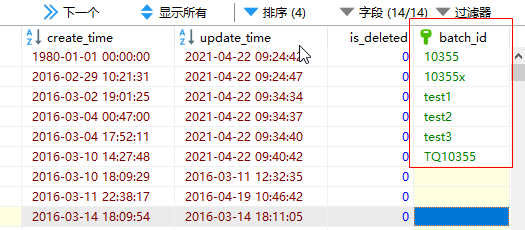
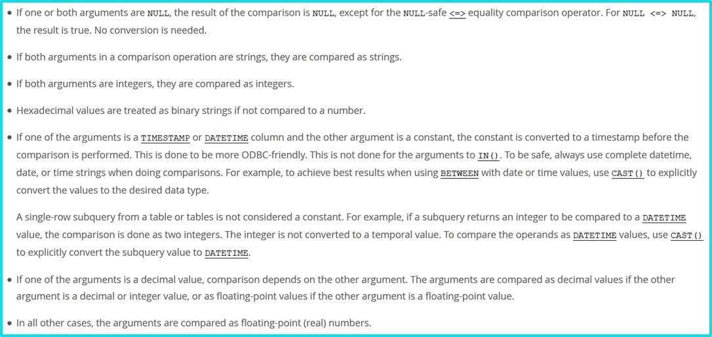

# 常见踩坑

### 常见空指针

#### 包装类空指针问题
```Java
public class NullPointTest {

    public static void main(String[] args) throws InterruptedException {
        System.out.println(testInteger(null));
    }

    //包装类型，传参可能为null，直接计算，则会导致空指针问题
    private static Integer testInteger(Integer i) {
        return i + 1;  
    }
}
```
**注意:** 包装类型，传参可能为null，直接计算，则会导致空指针问题使用前需要判断null,或者使用java8的OPtional类,同时使用基本类型是有默认值的,注意异常情况下的默认值问题.

#### 级联调用的空指针问题
```Java
public class NullPointTest {
    public static void main(String[] args) {
       //fruitService.getAppleService() 可能为空，会导致空指针问题,级联调用要注意不为null
        fruitService.getAppleService().getWeight().equals("OK");
    }
}
```

#### Equals方法左边的空指针问题
```Java
public class NullPointTest {
    public static void main(String[] args) {
        String s = null;
        //s为空，会导致空指针问题出现,一般使用一定为非空的放前面或者使用前加个空判断
        if (s.equals("哈哈哈")) { 
            System.out.println("666");
        }
    }
}
```

#### ConcurrentHashMap 不支持 Key，Value 为 null
```Java
public class NullPointTest {
    public static void main(String[] args) {
        Map map = new ConcurrentHashMap<>();
        String key = null;
        String value = null;
        map.put(key, value);
    }
}
```

#### 集合，数组直接获取元素
```Java
public class NullPointTest {
    public static void main(String[] args) {
        int [] array=null;
        List list = null;
        //空指针异常 使用前要判断null
        System.out.println(array[0]); 
        //空指针异常  使用前要判断null
        System.out.println(list.get(0)); 
    }
}
```

#### 对象直接获取属性
```Java
public class NullPointTest {
    public static void main(String[] args) {
        User user=null;
        //空指针异常 对象调用前要判断空
        System.out.println(user.getAge()); 
    }
}
```

### Java日期格式设置的坑
正常没问题的日期格式  yyyy-MM-dd HH:mm:ss
1. 年份设置为YYYY大写的时候,存在年份异常
>因为YYYY是基于周来计算年的，它指向当天所在周属于的年份，一周从周日开始算起，周六结束，只要本周跨年，那么这一周就算下一年的了。

2. 天设置为DD大写的时候,存在日期异常
>DD代表的是处于这一年中那一天，dd处于这个月的那一天

3. 小时设置HH 日期异常
>小时设置HH 表示24小时制  hh表示12小时制

### 金额数值计算精度的坑
>计算机是以二进制存储数值的，对于浮点数也是存在精度缺失   所以比较时尽量使用 BigDecimal 类型(构造小数对象一定要使用字符串的构造方法否则也可能出现异常)   如果实在要使用基本类型 建议指定精度差
>Java 中默认的数值类型为  double

**例:**
```java
// 非字符串构造
public class DoubleTest {
    public static void main(String[] args) {
        System.out.println(new BigDecimal(0.1).add(new BigDecimal(0.2)));
		System.out.println(new BigDecimal(1.0).subtract(new BigDecimal(0.8)));
		System.out.println(new BigDecimal(4.015).multiply(new BigDecimal(100)));
		System.out.println(new BigDecimal(123.3).divide(new BigDecimal(100)));
    }
}


// 使用字符串构造方法
public class DoubleTest {
    public static void main(String[] args) {
        System.out.println(new BigDecimal("0.1").add(new BigDecimal("0.2")));
        System.out.println(new BigDecimal("1.0").subtract(new BigDecimal("0.8")));
        System.out.println(new BigDecimal("4.015").multiply(new BigDecimal("100")));
        System.out.println(new BigDecimal("123.3").divide(new BigDecimal("100")));
    }
}
```

**注意:** BigDecimal指定几位小数点，注意它的八种舍入模式

### Integer缓存可能导致问题
例:
```Java
public class IntegerTest {

    public static void main(String[] args) {
        Integer a = 127;
        Integer b = 127;
        System.out.println("a==b:"+ (a == b));
        
        Integer c = 128;
        Integer d = 128;
        System.out.println("c==d:"+ (c == d));
    }
}

// 结果 a==b 为true
// 结果 c==d 为false
```
结果为什么会这样呢?让我们看看源码
```java
public class IntegerTest {
    public static Integer valueOf(int i) {
      if (i >= IntegerCache.low && i <= IntegerCache.high)
          return IntegerCache.cache[i + (-IntegerCache.low)];
      return new Integer(i);
    }
}
```
默认情况下呢，这个缓存区间就是[-128, 127] 这区间内使用`==`比较会是值的比较,超过这个区间使用的为对象比较,比较的为内存地址,故不相等,这个参数可以调整,设置 JVM 参数加上 -XX:AutoBoxCacheMax=1000可以调整范围


### static静态变量依赖spring实例化变量,可能导致初始化出错
例:
```
private static SmsService smsService = SpringContextUtils.getBean(SmsService.class);
```
这代码在启动过程中可能报错,在启动过程中JVM加载类的顺序是不确定的,有可能运行时类还没加载所以可能出错
改后:
```
// 初始化占坑
private static SmsService  smsService =null;
//使用到的时候判断获取(适合单列模式,原型模式可能有线程安全问题)
public static SmsService getSmsService(){
if(smsService==null){
  smsService = SpringContextUtils.getBean(SmsService.class);
}
return smsService;
}
```

### ThreadLocal使用后未清除导致错乱
```
private static final ThreadLocal<Integer> currentUser = ThreadLocal.withInitial(() -> null);

@GetMapping("wrong")
public Map wrong(@RequestParam("userId") Integer userId) {
    //设置用户信息之前先查询一次ThreadLocal中的用户信息
    String before  = Thread.currentThread().getName() + ":" + currentUser.get();
    //设置用户信息到ThreadLocal
    currentUser.set(userId);
    //设置用户信息之后再查询一次ThreadLocal中的用户信息
    String after  = Thread.currentThread().getName() + ":" + currentUser.get();
    //汇总输出两次查询结果
    Map result = new HashMap();
    result.put("before", before);
    result.put("after", after);
    return result;
}

```
项目中,一般都是使用线程池的,线程使用完后可能会重新使用,所以业务逻辑完成后,一定要记得清除,ThreadLocal

```
@GetMapping("right")
public Map right(@RequestParam("userId") Integer userId) {
    String before  = Thread.currentThread().getName() + ":" + currentUser.get();
    currentUser.set(userId);
    try {
        String after = Thread.currentThread().getName() + ":" + currentUser.get();
        Map result = new HashMap();
        result.put("before", before);
        result.put("after", after);
        return result;
    } finally {
        //在finally代码块中删除ThreadLocal中的数据，确保数据不串
        currentUser.remove();
    }
}
```

### 使用 switch 疏忽 return和break 或者 参数为null
```Java
public class SwitchTest {

    public static void main(String[] args) throws InterruptedException {
        System.out.println("testSwitch结果是："+testSwitch("2"));
    }

    private static String testSwitch(String key) {
        switch (key) {
            case "1":
                System.out.println("1");
            case "2":
                System.out.println("2");
            case "3":
                System.out.println("3");
            default:
                System.out.println("默认值");
                return "4";
        }
    }
}
```
switch 会沿着case一直往下匹配,如果有符合就执行后面的逻辑,如果没有return或者break,则符合后面的不符合的case代码也将被执行,直到遇到return或者break,注意参数为`null`,不会走默认方法,将会报空指针异常


### Arrays.asList的几个坑

#### 基本类型不能作为 Arrays.asList方法的参数，否则会被当做一个参数(只取第一个)
```Java
public class ArrayAsListTest {
    public static void main(String[] args) {
        int[] array = {1, 2, 3};
        List list = Arrays.asList(array);
        System.out.println(list.size());
    }
}
```

####  Arrays.asList 返回的 List 不支持增删操作
```Java
public class ArrayAsListTest {
    public static void main(String[] args) {
        String[] array = {"1", "2", "3"};
        List list = Arrays.asList(array);
        list.add("5");
        System.out.println(list.size());
    }
}
```
如果对其操作会出现不支持操作异常,java.lang.UnsupportedOperationException


#### 使用Arrays.asLis的时候，对原始数组的修改会影响到我们获得的那个List
```Java
public class ArrayAsListTest {
    public static void main(String[] args) {
        String[] arr = {"1", "2", "3"};
        List list = Arrays.asList(arr);
        arr[1] = "4";
        System.out.println("原始数组"+Arrays.toString(arr));
        System.out.println("list数组" + list);
    }
}
```
从运行结果可以看到，原数组改变，Arrays.asList转化来的list也跟着改变啦，使用的时候要注意一下哦，可以用new ArrayList(Arrays.asList(arr))包一下的。

#### ArrayList.toArray() 强转的坑
```Java
public class ArrayAsListTest {
    public static void main(String[] args) {
        List<String> list = new ArrayList<String>();
        list.add("666");

        // 正常可以
        String[] array1 = list.toArray(new String[list.size()]);
        System.out.println("转换后的:"+array1);

        //强转类型异常
        String[] array = (String[])list.toArray();
    }
}
```

### MySQL隐式转换的坑

**注意:**数据库隐式类型转换可能导致不走索引,条件失控,一定要避免

数据中有如下数据


```sql
SELECT * FROM mobile_coupon_activity where batch_id = "0";
-- 查询结果为等于0字符的
SELECT COUNT(*) FROM mobile_coupon_activity where batch_id = 0;
-- 查询结果为数据库中不能转化为int类型的所有的数据
SELECT * FROM mobile_coupon_activity where batch_id = "10355";
-- 查询结果一条 等于 "10355"的
SELECT * FROM mobile_coupon_activity where batch_id = 10355;
-- 查询结果两条 等于10355的和可以转化int的10355的

-- 当字符串和int比较时,如果该字段的值不能转换为int时,取前缀数字转换,如果前缀没有数字，则转化为0
```



>两个参数至少有一个是 NULL 时，比较的结果也是 NULL，例外是使用 <=> 对两个 NULL 做比较时会返回 1，这两种情况都不需要做类型转换
 两个参数都是字符串，会按照字符串来比较，不做类型转换
 两个参数都是整数，按照整数来比较，不做类型转换
 十六进制的值和非数字做比较时，会被当做二进制串
 有一个参数是 TIMESTAMP 或 DATETIME，并且另外一个参数是常量，常量会被转换为 timestamp
 有一个参数是 decimal 类型，如果另外一个参数是 decimal 或者整数，会将整数转换为 decimal 后进行比较，如果另外一个参数是浮点数，则会把 decimal 转换为浮点数进行比较
 所有其他情况下，两个参数都会被转换为浮点数再进行比较
 
> 实际使用中经研究发现字符串和数字比较时，优先把字符串转换为数字，当字符串不能转换为数字时，取前缀数字转换，没有前缀数字则是0

### JSON序列化,Long类型被转成Integer类型
```Java
public class JSONTest {
    public static void main(String[] args) {

        Long idValue = 3000L;
        Map<String, Object> data = new HashMap<>(2);
        data.put("id", idValue);
        data.put("name", "666");

        Assert.assertEquals(idValue, (Long) data.get("id"));
        String jsonString = JSON.toJSONString(data);

        // 反序列化时Long被转为了Integer
        Map map = JSON.parseObject(jsonString, Map.class);
        Object idObj = map.get("id");
        System.out.println("反序列化的类型是否为Integer："+(idObj instanceof Integer));
        Assert.assertEquals(idValue, (Long) idObj);
        // 会抛出异常 java.lang.ClassCastException: java.lang.Integer cannot be cast to java.lang.Long
    }
}
```

### 当反射遇到方法重载的坑,不会根据传入值,而是反射获得方法时传入的方法名和参数获得的
```Java
public class ReflectionTest {

    private void score(int score) {
        System.out.println("int grade =" + score);
    }

    private void score(Integer score) {
        System.out.println("Integer grade =" + score);
    }

    public static void main(String[] args) throws Exception {
        ReflectionTest reflectionTest = new ReflectionTest();
        reflectionTest.score(100);
        reflectionTest.score(Integer.valueOf(100));
        // 传入的都是为Integer 但是走了两个不同的方法
        // 如果方法有重载,反射使用的不是根据值的类型来获得的的,而是以反射获取方法时传入的方法名称和参数类型来确定
        reflectionTest.getClass().getDeclaredMethod("score", int.class).invoke(reflectionTest, Integer.valueOf("58"));
        reflectionTest.getClass().getDeclaredMethod("score", Integer.class).invoke(reflectionTest, Integer.valueOf("60"));

    }
}
```

### MySQL 时间 timestamp的坑
```SQL
CREATE TABLE `t` (
  `a` int(11) DEFAULT NULL,
  `b` timestamp  NOT NULL,
  `c` timestamp NOT NULL DEFAULT CURRENT_TIMESTAMP ON UPDATE CURRENT_TIMESTAMP
) ENGINE=InnoDB DEFAULT CHARSET=utf8
-- 「c列」是有CURRENT_TIMESTAMP ON UPDATE CURRENT_TIMESTAMP，所以c列会随着记录更新而「更新为当前时间」。但是b列也会随着有记录更新为而「更新为当前时间」
-- 不使用DEFAULT或ON UPDATE子句，那么它等同于DEFAULT CURRENT_TIMESTAMP ON UPDATE CURRENT_TIMESTAMP
```
在CREATE TABLE语句中，timestamp列可以用下面的任何一种方式声明：
- 如果定义时DEFAULT CURRENT_TIMESTAMP和ON UPDATE CURRENT_TIMESTAMP子句都有，列值为默认使用当前的时间戳，并且自动更新;
- 如果不使用DEFAULT或ON UPDATE子句，那么它等同于DEFAULT CURRENT_TIMESTAMP ON UPDATE CURRENT_TIMESTAMP;
- 如果只有DEFAULT CURRENT_TIMESTAMP子句，而没有ON UPDATE子句，列值默认为当前时间戳但不自动更新;
- 如果没用DEFAULT子句，但有ON UPDATE CURRENT_TIMESTAMP子句，列默认为0并自动更新;
- 如果有一个常量值DEFAULT，该列会有一个默认值，而且不会自动初始化为当前时间戳。如果该列还有一个ON UPDATE CURRENT_TIMESTAMP子句，这个时间戳会自动更新，否则该列有一个默认的常量但不会自动更新;


### MySQL8 数据库的时区坑
MySQL8默认为UTC时区（世界标准时间），需要使用时区参数指定下时区,否则使用可能导致时间误差
```
serverTimezone=Asia/Shanghai
```


