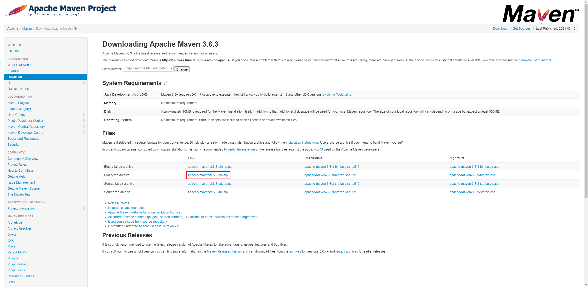
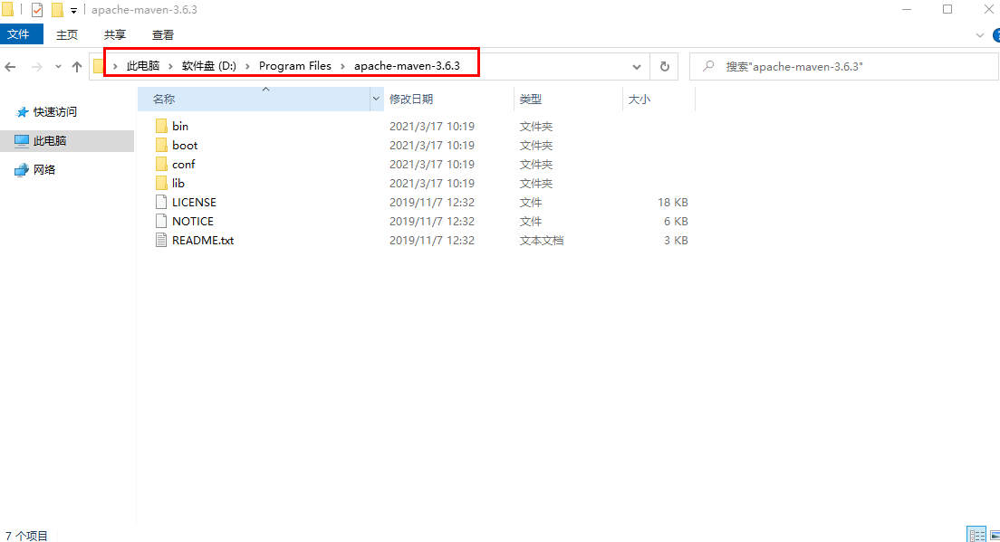
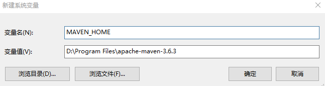
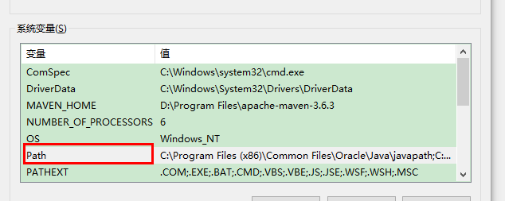
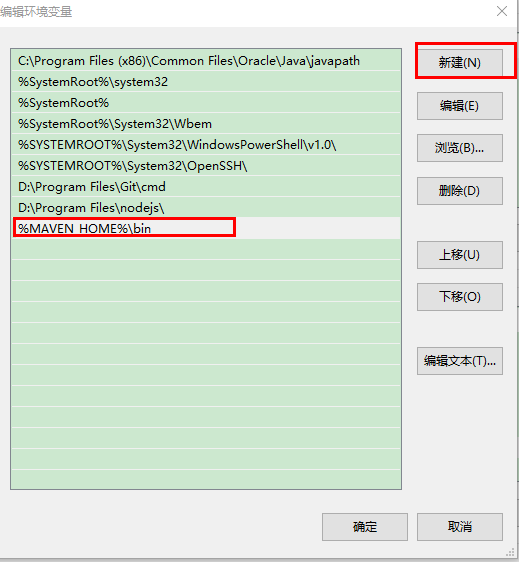
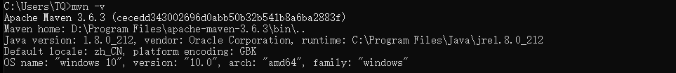
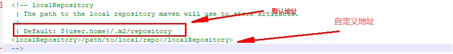

# Maven

## Maven 介绍

Apache Maven是一个软件项目管理和综合工具。
基于项目对象模型（POM）的概念，Maven可以从一个中心资料片管理项目构建，报告和文件。它是一个项目管理和综合工具， 其核心的依赖管理， 项目信息管理， 中央仓库， 约定大于配置的核心功能使得Maven成为当前Java项目构建和管理工具的标准选择。


## Maven 安装

### 下载 Maven
[官方下载](http://maven.apache.org/download.cgi)
根据情况选择合适的版本,这里我选择的zip压缩包


### 解压配置环境变量
将下载的文件解压到一个目录,复制解压地址后添加环境变量(需要依赖jdk)


添加环境变量

添加环境名称为`MAVEN_HOME`的环境变量,变量值为刚复制的解压地址



添加完成后将环境变量加入Path 

```
%MAVEN_HOME%\bin
```


进入Path编辑->新建->粘贴`%MAVEN_HOME%\bin`



### 检查安装是否成功
进入cmd 输入 `mvn -v` 输出如下,则安装成功



## Maven 约定
- src/main/java        存放项目的java文件
- src/main/resources   存放项目的资源文件，如spring，hibernate的配置文件
- src/test/java        存放所有的测试的java文件
- src/test/resources   存放测试用的资源文件
- target               项目输出位置
- pom.xml              文件

pom 文件说明
```
<!-- 组织名-->
<groupId>
<!-- 项目/模块名称 -->
<artifactId>
<!-- 版本号+类型 -->
<version>
<!-- 打包类型，默认是jar，可以配置成war、zip、pom类型 -->
<packaging>
<!-- 属性值标签，也叫变量标签 -->
<properties>
<!--  依赖标签 -->
<dependencies> 
<!-- 发布管理 -->
<distributionManagement> 
<repository>
<id>nexus-releases</id>
<name>Local Nexus Repository</name>
<url>http://ip:port/nexus/content/repositories/releases/</url>
</repository>
<snapshotRepository>
<id>nexus-snapshots</id>
<name>Local Nexus Repository</name>
<url>http://ip:port/nexus/content/repositories/snapshots/</url>
</snapshotRepository>
</distributionManagement>

<!-- 指定JDK版本 -->
<build>
     <plugins>
         <plugin>
             <groupId>org.apache.maven.plugins </groupId>
             <artifactId>maven-compiler-plugin </artifactId>
             <version>2.1</version>
             <configuration>
                 <source>1.8</source>
                 <target>1.8</target>
             </configuration>
         </plugin>
     </plugins>
</build>
<!-- 指定编码 -->
<properties>
    <project.build.sourceEncoding>UTF-8</project.build.sourceEncoding>
    <maven.compiler.encoding>UTF-8</maven.compiler.encoding>
</properties>
<!-- 模块化开发 -->
<modules>
    <module>模块名1</module>
    <module>模块名2</module>
    <module>模块名3</module>
</modules>
<packaging>pom</packaging>

<!-- 添加本地外部jar包依赖 -->
<dependencies>
    <dependency>
        <groupId>ldapjdk</groupId>  <!-- 库名称，也可以自定义 -->
        <artifactId>ldapjdk</artifactId>    <!--库名称，也可以自定义-->
        <version>1.0</version> <!--版本号-->
        <scope>system</scope> <!--作用域-->
        <systemPath>${basedir}\src\lib\ldapjdk.jar</systemPath> <!--项目根目录下的lib文件夹下-->
    </dependency> 
</dependencies>

```


## Maven 全局配置
进入我们的解压目录下,conf文件夹可以看见
settings.xml 文件 为maven的全局配置文件,大概包含本地仓储位置、修改远程仓储服务器、认证信息等配置

### Maven配置的优先级
局部配置优先于全局配置, 配置优先级从高到低：pom.xml> user settings > global settings,如果这些文件同时存在,应用时将合并内容,如果有重复的将安装优先级的顺序高的配置覆盖低的配置
`localRepository` 本地仓库地址
`mirror` 远程仓库地址
`server` 远程仓库账号
`profile` 指定文件配置

### Maven配置本地仓库位置
配置本地仓库地址,去settings.xml文件搜 localRepository 配置



添加自定本地仓库配置
```
<localRepository>D:\repository</localRepository>
```

### Maven配置远程仓库
Maven默认的远程地址是  http://my.repository.com/repo/path 国内访问过慢

改使用华为云的远程仓库 添加
`mirrors` 节点下添加
```xml
<mirror>
    <id>huaweicloud</id>
    <mirrorOf>*</mirrorOf>
    <url>https://mirrors.huaweicloud.com/repository/maven/</url>
</mirror>
```

### Maven配置jdk环境
`profiles` 节点下添加 指定修改默认jdk版本
```xml
<profile>     
    <id>JDK-1.8</id>       
    <activation>       
        <activeByDefault>true</activeByDefault>       
        <jdk>1.8</jdk>       
    </activation>       
    <properties>       
        <maven.compiler.source>1.8</maven.compiler.source>       
        <maven.compiler.target>1.8</maven.compiler.target>       
        <maven.compiler.compilerVersion>1.8</maven.compiler.compilerVersion>       
    </properties>       
</profile>
```

验证配置是否生效,进入cmd 输入 `mvn help:system`


## Maven 常用命令
清理项目
```
mvn clean
```
打包项目  [- Dmaven.test.skip=true 不执行也不编译测试代码] 
```
mvn package [- Dmaven.test.skip=true]
```
打包并上传本地仓库
```
mvn install
```
打包发布到私服并更新本地仓库
```
mvn deploy
```