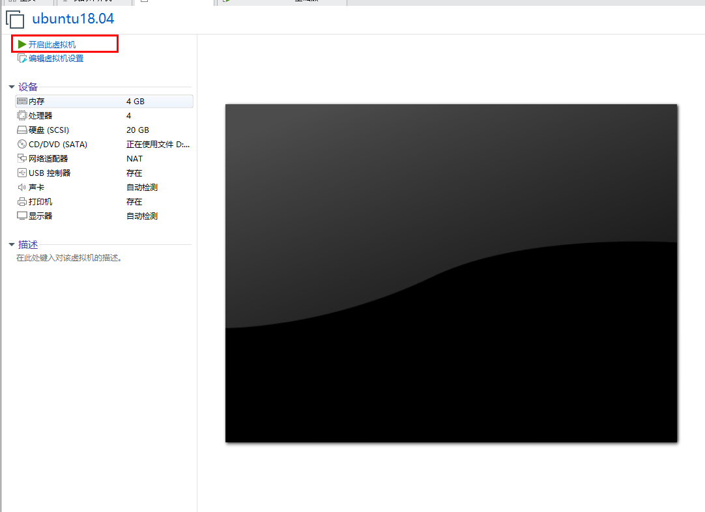

# 虚拟机

我使用的为win10的系统,这与我们常常部署使用的Linux不同,所以我们要安装一些虚拟机来在win10系统上安装Liunx

## VMware 安装

这里我使用的为 VMware Workstation 15.0.4 版本 下载安装没啥特别的 这里提供一个激活码用于学习使用

VMware Workstation 15输入许可证密钥`CG392-4PX5J-H816Z-HYZNG-PQRG2`


## Linux 系统镜像下载
这里我使用的为 ubuntu 18.04 版本,具体可以百度下载iso的镜像

##  VMware 安装 ubuntu 系统
1.安装完成后打开软件,进入主页,创建新的虚拟机


2.选择自定义


3.选择软件的版本兼容性,下一步


4.这里选择创建一个空的,稍后安装


5.选择你ISO镜像文件系统的属性


6.命名虚拟机的名称和保持地址


7.配置虚拟机的CPU配置


8.配置虚拟机的内存大小


9.配置虚拟机的网络连接方式,这里选择NAT本机使用一下


10.配置控制器


11.配置磁盘种类


12.选择磁盘


13.配置磁盘大小


14.配置磁盘文件存储位置


15.创建空白虚拟机完成


16.将ISO镜像文件装入


17.将ISO镜像文件装入,选择ISO镜像文件路径


18.将ISO镜像文件装入后选择开启次虚拟机,有可能需要输入回车键



19.进入ubuntu系统安装,选择语言


20.进入ubuntu系统安装,选择键盘


21.安装系统


22.网卡配置


23.代理配置


24.镜像地址,此处改成用阿里的软件源


25.如果要支持磁盘扩容,必须选择第二种


26.磁盘挂载


27.磁盘挂载,调整占比 


28.设置用户名和密码


29.选上OpenSSH,为了以后可以用工具连接


30.这里可以按需求选择安装,我没有要的


31.等待安装完成


32.安装完成,重启


33.重启后,可以使用我们当时设置的用户和密码登陆(虚拟机安装完成)


34.安装完成后,关机,选中虚拟机然后右键->管理->克隆,克隆虚拟机以防虚拟机损坏后要重新安装


35.此时登陆机器后不是root 账号,操作起来不方便,我们修改一下使用root登陆
[允许使用root账号远程登陆](../Linux/001_Linux基础?id=使用-root-用户)

36.集群服务中防止时间问题,我们需要设置一下时区和同步时间
使用 tzselect 命令设置时区
```
tzselect
```


使用ntpdate更新时间,如果没安装ntpdate需要安装
```
apt-get install ntpdate
```

中国公共NTP服务器同步时间
```
ntpdate cn.pool.ntp.org
```
以系统时间为基准,写入硬件时间
 ```
hwclock --systohc
 ```

设置主机名称(/etc/hostname文件的内容进行修改是永久修改)
```
hostnamectl set-hostname dockerBase
```

在ubuntu的18.04版本中重启后会失效,修改/etc/cloud/cloud.cfg 文件15行位置 为true
```
vim /etc/cloud/cloud.cfg
```


