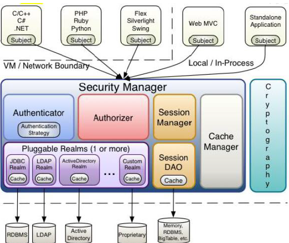

# Shiro
官网[传送](http://shiro.apache.org/)
## Shiro是什么?
> Shiro是Java 的一个安全（权限）框架，其不仅可以用在JavaSE环境，也可以用在JavaEE环境。
Shiro可以完成：认证、授权、加密、会话管理、与Web 集成、缓存等。

#### Shiro流程

- `Subject`：应用代码直接交互的对象是Subject，也就是说Shiro的对外API 核心就是Subject。Subject 代表了当前“用户”，这个用户不一定是一个具体的人，与当前应用交互的任何东西都是Subject，如网络爬虫，机器人等；与Subject 的所有交互都会委托给SecurityManager；Subject 其实是一个门面，SecurityManager才是实际的执行者；
- `SecurityManager`：安全管理器；即所有与安全有关的操作都会与SecurityManager交互；且其管理着所有Subject；可以看出它是Shiro的核心，它负责与Shiro的其他组件进行交互，它相当于SpringMVC中DispatcherServlet的角色
- `Realm`：Shiro从Realm 获取安全数据（如用户、角色、权限），就是说SecurityManager要验证用户身份，那么它需要从Realm 获取相应的用户进行比较以确定用户身份是否合法；也需要从Realm 得到用户相应的角色/权限进行验证用户是否能进行操作；可以把Realm 看成DataSource
#### Shiro架构

- `Subject`：任何可以与应用交互的“用户”；
- `SecurityManager`：相当于SpringMVC中的DispatcherServlet；是Shiro的心脏；所有具体的交互都通过SecurityManager进行控制；它管理着所有Subject、且负责进行认证、授权、会话及缓存的管理。
- `Authenticator`：负责Subject 认证，是一个扩展点，可以自定义实现；可以使用认证策略（Authentication Strategy），即什么情况下算用户认证通过了；
- `Authorizer`：授权器、即访问控制器，用来决定主体是否有权限进行相应的操作；即控制着用户能访问应用中的哪些功能；
- `Realm`：可以有1 个或多个Realm，可以认为是安全实体数据源，即用于获取安全实体的；可以是JDBC 实现，也可以是内存实现等等；由用户提供；所以一般在应用中都需要实现自己的Realm；
- `SessionManager`：管理Session 生命周期的组件；而Shiro并不仅仅可以用在Web 环境，也可以用在如普通的JavaSE环境
- `CacheManager`：缓存控制器，来管理如用户、角色、权限等的缓存的；因为这些数据基本上很少改变，放到缓存中后可以提高访问的性能
- `Cryptography`：密码模块，Shiro提高了一些常见的加密组件用于如密码加密/解密。

## 